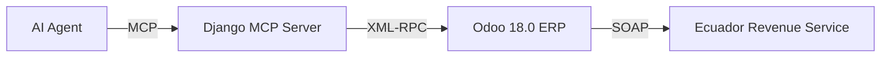

# SomaTech Odoo SaaS Ecuador (U-OMS)

[](https://somatechlat.com)
[](https://odoo.com)
[](https://djangoproject.com)
[]()

## 🚀 The Architecture (Clarified)
This project combines two powerful Python technologies:

1.  **Odoo 18.0 (The Core)**: The ERP system. It uses its **own custom framework** (not Django) for the database, UI, and business logic.
2.  **Django MCP Server (The Brain)**: A separate **Django Ninja** service that acts as the "Agent Interface". It talks to Odoo via XML-RPC.



## 📂 Repository Structure

```text
.
├── django_mcp/             # The "Brain" (Django Ninja)
│   ├── api/                # Universal Tools endpoints
│   ├── services/           # XML-RPC Client
│   └── manage.py
├── odoo_custom_addons/     # The "Body" (Odoo Modules)
│   └── l10n_ec_sri/        # 100% SRI Compliance Module
└── docker-compose.yml      # The "Complete Installer"
```

## 🛠️ Complete Installation (Docker)

We provide a production-ready `docker-compose` stack that boots both the ERP and the Control Layer.

```bash
# 1. Start the Stack
docker-compose up -d --build

# 2. Access Odoo (The ERP)
# URL: http://localhost:8069
# User: admin / Password: admin

# 3. Access Agent API (The Interface)
# URL: http://localhost:8000/api/docs
```

## 🇪🇨 SRI Features (l10n_ec_sri)
- **Automatic Signing**: XAdES-BES with `.p12` certificates.
- **Offline Mode**: SRI "Offline" scheme (Asynchronous).
- **Compliance**: 2025-2026 Regulations (15% IVA, RIDE qWeb).
