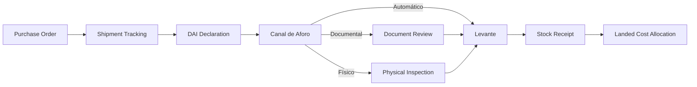
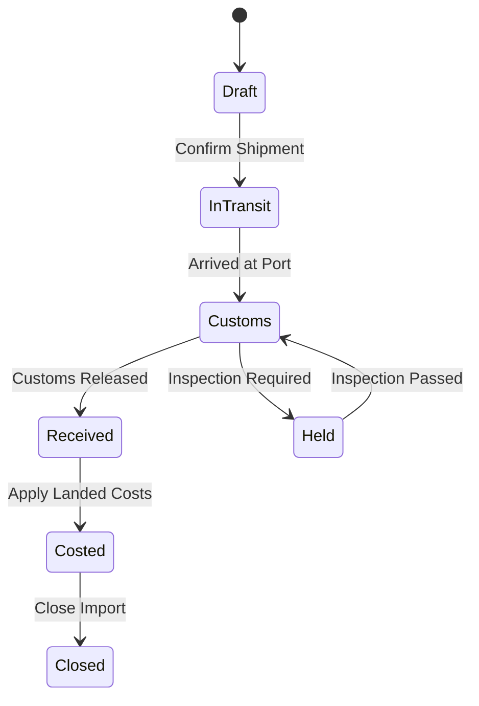
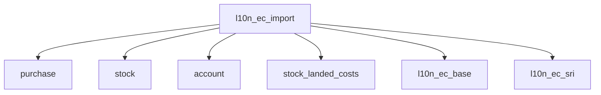

# SRS: SOMATECH ECUADOR IMPORT MANAGEMENT MODULE
> **Complete Import Calculation & SENAE Compliance System**
> **Version 1.0** | 2026-01-24

---

# 1. EXECUTIVE SUMMARY

## 1.1 Purpose

This document specifies the requirements for a comprehensive **Import Management Module** for Odoo 18, designed for Ecuadorian businesses. The module automates import calculations, integrates with SENAE (Servicio Nacional de Aduana del Ecuador), and ensures full regulatory compliance for tributos aduaneros.

## 1.2 Scope

| Aspect | Coverage |
|--------|----------|
| **Regulatory Body** | SENAE (Servicio Nacional de Aduana del Ecuador) |
| **Document Types** | DAI/DAU (Declaración Aduanera de Importación/Única) |
| **Tax Types** | Aranceles, FODINFA, ISD, IVA, Salvaguardias |
| **Integration** | Odoo Purchase, Stock, Accounting |
| **Standards** | HS Codes (Sistema Armonizado), ECUAPASS |

## 1.3 Key Business Value

```
┌─────────────────────────────────────────────────────────────────────┐
│                      BUSINESS VALUE PROPOSITION                      │
├─────────────────────────────────────────────────────────────────────┤
│                                                                     │
│  ✅ Automatic calculation of ALL import taxes and duties           │
│  ✅ Accurate landed cost distribution to products                  │
│  ✅ Full SENAE regulatory compliance (2026)                        │
│  ✅ Multi-purchase order consolidation per shipment                │
│  ✅ Real-time CIF/FOB value tracking                               │
│  ✅ Complete audit trail for customs authorities                   │
│                                                                     │
└─────────────────────────────────────────────────────────────────────┘
```

---

# 2. REGULATORY FRAMEWORK (ECUADOR 2026)

## 2.1 Import Taxes & Duties

| Tax | Rate | Base | Authority |
|-----|------|------|-----------|
| **Aranceles (Ad Valorem)** | 0-40% | CIF Value | SENAE |
| **Aranceles Específicos** | Fixed $/unit | Quantity | SENAE |
| **FODINFA** | 0.5% | CIF Value | MIES |
| **ISD** | 5% | Payments Abroad | SRI |
| **IVA Importación** | 15% | CIF + Duties + FODINFA | SRI |
| **Salvaguardia Colombia** | 30% | CIF (from Feb 2026) | SENAE |

> [!IMPORTANT]
> All rates MUST be configurable via `ir.config_parameter`. NO hardcoded values.

## 2.2 SENAE Processes



## 2.3 Canal de Aforo (Customs Channels)

| Channel | Description | Action |
|---------|-------------|--------|
| **Automático** | Low risk, auto-release | None required |
| **Documental** | Document verification | Upload documents |
| **Físico** | Physical inspection | Schedule inspection |
| **Físico No Intrusivo** | Scanner inspection | Schedule scan |

---

# 3. FUNCTIONAL REQUIREMENTS

## 3.1 Import Order (Orden de Importación)

### 3.1.1 Core Fields

| Field | Type | Description |
|-------|------|-------------|
| `name` | Char | Import order number (auto-sequence) |
| `dau_number` | Char | SENAE DAI/DAU number |
| `regime` | Selection | Import regime (10, 20, 21, 70, etc.) |
| `state` | Selection | Draft → In Transit → Customs → Received → Costed → Closed |
| `supplier_id` | Many2one | Foreign supplier |
| `broker_id` | Many2one | Customs agent (Agente de Aduanas) |
| `incoterm_id` | Many2one | Incoterm (FOB, CIF, EXW, etc.) |
| `currency_id` | Many2one | Invoice currency |
| `exchange_rate` | Float | USD exchange rate at declaration date |

### 3.1.2 Value Fields

| Field | Type | Description | Calculation |
|-------|------|-------------|-------------|
| `fob_value` | Monetary | FOB value (USD) | Sum of line FOB |
| `freight_cost` | Monetary | International freight | Manual entry |
| `insurance_cost` | Monetary | Insurance | Manual or % of FOB |
| `cif_value` | Monetary | CIF value | FOB + Freight + Insurance |

### 3.1.3 Tax Fields (Auto-Calculated)

| Field | Type | Description | Formula |
|-------|------|-------------|---------|
| `total_ad_valorem` | Monetary | Customs duties | Sum of line duties |
| `total_fodinfa` | Monetary | FODINFA | CIF × 0.5% |
| `total_isd` | Monetary | ISD | Foreign payments × 5% |
| `total_salvaguardia` | Monetary | Safeguard duties | CIF × rate (if applicable) |
| `iva_base` | Monetary | IVA base | CIF + duties + FODINFA |
| `total_iva` | Monetary | IVA amount | IVA base × 15% |
| `total_tributos` | Monetary | Total taxes | Sum of all taxes |
| `total_nacionalizado` | Monetary | Total landed | CIF + tributos + expenses |

### 3.1.4 State Machine



## 3.2 Import Lines (Líneas de Importación)

### 3.2.1 Core Fields

| Field | Type | Description |
|-------|------|-------------|
| `import_id` | Many2one | Parent import order |
| `purchase_line_id` | Many2one | Source purchase order line |
| `product_id` | Many2one | Product |
| `tariff_id` | Many2one | Tariff heading (HS Code) |
| `quantity` | Float | Quantity imported |
| `unit_fob` | Monetary | Unit FOB price |
| `total_fob` | Monetary | Line FOB value |

### 3.2.2 Calculated Fields

| Field | Type | Formula |
|-------|------|---------|
| `cif_ratio` | Float | (Header CIF / Header FOB) |
| `line_cif` | Monetary | FOB × CIF ratio |
| `ad_valorem_rate` | Float | From tariff heading |
| `ad_valorem_amount` | Monetary | CIF × ad_valorem_rate |
| `specific_duty` | Monetary | Quantity × specific_rate |
| `total_duty` | Monetary | ad_valorem + specific |
| `line_fodinfa` | Monetary | CIF × 0.5% |
| `line_iva` | Monetary | (CIF + duty + fodinfa) × 15% |
| `landed_cost` | Monetary | All costs allocated to line |
| `unit_landed_cost` | Monetary | landed_cost / quantity |

## 3.3 Tariff Headings (Partidas Arancelarias)

### 3.3.1 Model: `l10n_ec.tariff.heading`

| Field | Type | Description |
|-------|------|-------------|
| `code` | Char | HS Code (e.g., 8471.30.00.00) |
| `name` | Char | Description |
| `ad_valorem` | Float | Ad valorem rate (%) |
| `specific_rate` | Float | Specific duty ($/unit) |
| `salvaguardia` | Float | Safeguard rate (%) |
| `fodinfa_exempt` | Boolean | FODINFA exempt |
| `iva_exempt` | Boolean | IVA exempt |
| `requires_permit` | Boolean | Requires import permit |
| `permit_type` | Char | Permit type (if required) |
| `country_restrictions` | Text | Origin restrictions |
| `active` | Boolean | Active status |

### 3.3.2 Product Integration

Products must be linkable to tariff headings:

```python
class ProductTemplate(models.Model):
    _inherit = 'product.template'

    l10n_ec_tariff_id = fields.Many2one(
        'l10n_ec.tariff.heading',
        string="Tariff Heading (HS Code)"
    )
```

## 3.4 Import Expenses (Gastos de Importación)

### 3.4.1 Model: `l10n_ec.import.expense`

| Field | Type | Description |
|-------|------|-------------|
| `import_id` | Many2one | Related import order |
| `expense_type` | Selection | Type of expense |
| `vendor_id` | Many2one | Service provider |
| `invoice_id` | Many2one | Related vendor bill |
| `amount` | Monetary | Expense amount |
| `allocation_method` | Selection | Distribution method |

### 3.4.2 Expense Types

| Code | Type | Example |
|------|------|---------|
| `freight_intl` | International Freight | Shipping line, airline |
| `freight_local` | Local Freight | Port to warehouse |
| `insurance` | Insurance | Cargo insurance |
| `broker` | Customs Agent | Agente de aduanas |
| `storage` | Storage | Port/warehouse storage |
| `handling` | Handling | Loading/unloading |
| `inspection` | Inspection | AGROCALIDAD, ARCSA |
| `permits` | Permits | Import permits |
| `banking` | Banking | LC fees, transfers |
| `other` | Other | Miscellaneous |

### 3.4.3 Allocation Methods

| Method | Description |
|--------|-------------|
| `by_value` | Proportional to FOB value |
| `by_quantity` | Equal per unit |
| `by_weight` | Proportional to weight |
| `by_volume` | Proportional to volume |
| `manual` | Manual allocation |

## 3.5 Purchase Order Integration

### 3.5.1 Fields Added to Purchase Order

| Field | Type | Description |
|-------|------|-------------|
| `l10n_ec_import_id` | Many2one | Related import order |
| `l10n_ec_is_import` | Boolean | Is import purchase |
| `l10n_ec_fob_total` | Monetary | FOB value |

### 3.5.2 Workflow

1. Create Purchase Order(s) with foreign supplier
2. Mark as "Import Purchase"
3. Create Import Order
4. Link Purchase Orders to Import
5. System copies lines to import lines
6. Calculate duties and taxes automatically

## 3.6 Stock Integration

### 3.6.1 Stock Picking Extension

| Field | Type | Description |
|-------|------|-------------|
| `l10n_ec_import_id` | Many2one | Related import order |
| `l10n_ec_dau_number` | Char | DAU reference |
| `l10n_ec_customs_status` | Selection | Customs clearance status |

### 3.6.2 Landed Cost Integration

When import is closed:
1. Create `stock.landed.cost` record
2. Distribute all tributos + expenses to products
3. Update product valuations
4. Generate accounting entries

## 3.7 Accounting Integration

### 3.7.1 Journal Entries

| Entry | Debit | Credit |
|-------|-------|--------|
| Tributos Payable | Tributos por Pagar | Bank/Payable |
| Landed Cost | Inventory Asset | Tributos por Pagar |
| IVA Credit | IVA Crédito Tributario | IVA por Pagar |

### 3.7.2 Tax Credit Handling

IVA paid on imports generates tax credit:
- Record in `IVA Crédito Tributario` account
- Available for offset against sales IVA
- Report in ATS (Anexo Transaccional Simplificado)

---

# 4. NON-FUNCTIONAL REQUIREMENTS

## 4.1 Performance

| Metric | Requirement |
|--------|-------------|
| Import calculation | < 1 second for 1000 lines |
| Report generation | < 5 seconds |
| Search/filter | < 2 seconds |

## 4.2 Security

| Requirement | Implementation |
|-------------|----------------|
| Role-based access | Import Manager, Import User, Read-only |
| Audit trail | Full logging of all changes |
| Data retention | Minimum 7 years (SRI requirement) |

## 4.3 Compliance

| Regulation | Requirement |
|------------|-------------|
| SENAE | DAU format, ECUAPASS compatible |
| SRI | ATS reporting, IVA credit |
| COPCI | Import regime codes |

---

# 5. USER INTERFACE REQUIREMENTS

## 5.1 Import Dashboard

```
┌─────────────────────────────────────────────────────────────────────┐
│  🚢 IMPORT DASHBOARD                                                │
├─────────────────────────────────────────────────────────────────────┤
│                                                                     │
│  📊 SUMMARY                                                         │
│  ┌─────────────┬─────────────┬─────────────┬─────────────┐         │
│  │ In Transit  │ At Customs  │ This Month  │ YTD Value   │         │
│  │     12      │      5      │   $125,000  │  $1.2M      │         │
│  └─────────────┴─────────────┴─────────────┴─────────────┘         │
│                                                                     │
│  📋 PENDING ACTIONS                                                 │
│  • IMP-2026-0045: Awaiting DAU number                              │
│  • IMP-2026-0043: Inspection scheduled 01/25                       │
│  • IMP-2026-0040: Ready for landed cost allocation                 │
│                                                                     │
└─────────────────────────────────────────────────────────────────────┘
```

## 5.2 Import Form

Key tabs:
1. **General** - Basic info, DAU, dates
2. **Lines** - Product lines with tariffs
3. **Taxes** - Calculated tributos
4. **Expenses** - Additional costs
5. **Documents** - Attached files
6. **Log** - Activity history

## 5.3 Cost Calculator

Real-time calculator showing:
- Unit FOB → Unit CIF → Unit Landed Cost
- Tax breakdown by line
- Total cost summary

---

# 6. CONFIGURATION

## 6.1 System Parameters

| Parameter | Key | Default | Description |
|-----------|-----|---------|-------------|
| FODINFA Rate | `l10n_ec.fodinfa` | 0.005 | FODINFA percentage |
| IVA Import | `l10n_ec.customs_iva` | 0.15 | IVA percentage |
| ISD Rate | `l10n_ec.isd_rate` | 0.05 | ISD percentage |
| Threshold | `l10n_ec.import_threshold` | 400 | 4x4 threshold USD |

> [!CAUTION]
> All configuration MUST be via `ir.config_parameter`.
> Code MUST raise error if configuration is missing.

## 6.2 Accounting Configuration

| Setting | Description |
|---------|-------------|
| Tributos Payable Account | Account for customs duties payable |
| FODINFA Expense Account | FODINFA expense account |
| IVA Credit Account | IVA crédito tributario |
| Landed Cost Journal | Journal for cost entries |

---

# 7. REPORTS

## 7.1 Required Reports

| Report | Purpose | Format |
|--------|---------|--------|
| **Import Summary** | Overview of import | PDF |
| **Landed Cost Report** | Cost breakdown by product | PDF/Excel |
| **Tributos Report** | Tax summary by period | PDF/Excel |
| **Import History** | Complete import log | PDF/Excel |
| **Tariff Analysis** | Duties by HS code | Excel |

## 7.2 ATS Integration

Generates data for:
- Casillero 401: FOB purchases
- Casillero 402: CIF value
- Casillero 403-405: Tributos
- Base imponible IVA

---

# 8. INTEGRATION POINTS

## 8.1 Module Dependencies



## 8.2 External Integrations

| System | Integration | Priority |
|--------|-------------|----------|
| ECUAPASS | DAU transmission | Phase 2 |
| Shipping APIs | Tracking | Phase 2 |
| Exchange Rate API | Daily rates | Phase 1 |

---

# 9. IMPLEMENTATION PHASES

## Phase 1: Core (MVP)

- [ ] Import order model
- [ ] Import lines with tariff lookup
- [ ] Automatic tax calculation
- [ ] Basic landed cost allocation
- [ ] Purchase order integration

## Phase 2: Advanced

- [ ] Expense management
- [ ] Multiple allocation methods
- [ ] Dashboard and reporting
- [ ] Tariff database (5000+ codes)

## Phase 3: Integration

- [ ] ECUAPASS integration
- [ ] Shipping API integration
- [ ] Advanced analytics

---

# 10. ACCEPTANCE CRITERIA

## 10.1 Functional Tests

| Test | Criteria |
|------|----------|
| TC-001 | Create import from purchase order |
| TC-002 | Calculate ad valorem correctly |
| TC-003 | Calculate FODINFA at 0.5% of CIF |
| TC-004 | Calculate IVA at 15% of (CIF + duties + FODINFA) |
| TC-005 | Distribute landed costs proportionally |
| TC-006 | Generate correct accounting entries |
| TC-007 | Update product valuation after costing |

## 10.2 Regulatory Tests

| Test | Criteria |
|------|----------|
| TR-001 | All rates from ir.config_parameter |
| TR-002 | Zero hardcoded values |
| TR-003 | Correct HS code lookup |
| TR-004 | Proper IVA credit handling |

---

# 11. GLOSSARY

| Term | Definition |
|------|------------|
| **DAU/DAI** | Declaración Aduanera Única/de Importación |
| **SENAE** | Servicio Nacional de Aduana del Ecuador |
| **CIF** | Cost, Insurance, Freight |
| **FOB** | Free On Board |
| **FODINFA** | Fondo de Desarrollo para la Infancia |
| **ISD** | Impuesto a la Salida de Divisas |
| **ECUAPASS** | SENAE electronic customs system |
| **HS Code** | Harmonized System tariff code |
| **Aforo** | Customs inspection channel |
| **Levante** | Customs release |

---

# 12. REFERENCES

| Source | URL |
|--------|-----|
| SENAE Portal | https://www.aduana.gob.ec |
| ECUAPASS | https://ecuapass.aduana.gob.ec |
| SRI | https://www.sri.gob.ec |
| Tariff Database | https://mesadeservicios.aduana.gob.ec |

---

**Document Control**

| Version | Date | Author | Changes |
|---------|------|--------|---------|
| 1.0 | 2026-01-24 | Somatech | Initial SRS |

