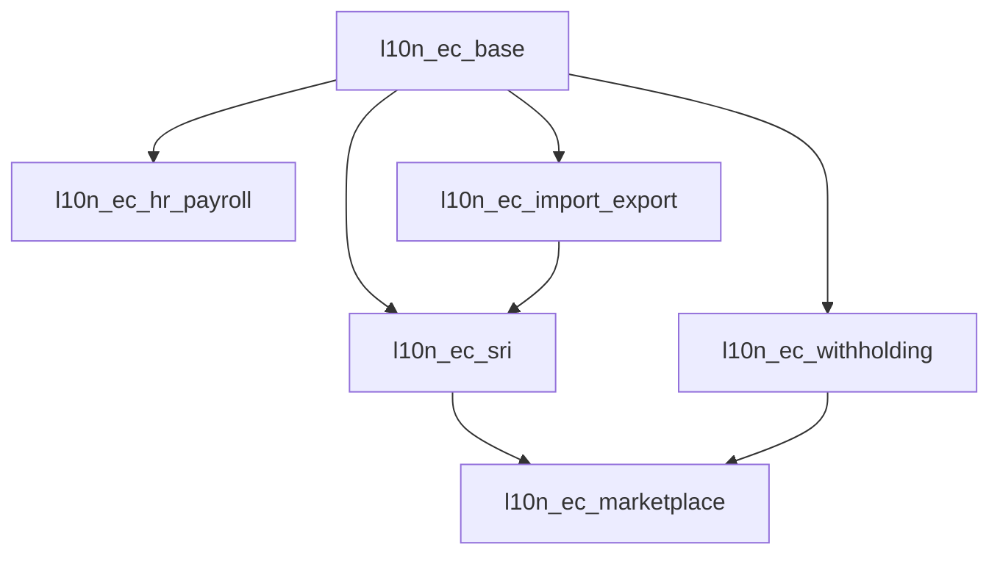

# SOMATECH ECUADOR ERP - MODULE REQUIREMENTS

> **Organized SRS Documentation by Module**
> **Version 2026.01** | All documents ISO 9001:2015 compliant

---

## 📁 FOLDER STRUCTURE

```
modules/
├── l10n_ec_hr_payroll/        → HR & Payroll (Nómina)
│   └── SRS_HR_PAYROLL_ECUADOR.md
│
├── l10n_ec_import_export/      → Imports & Exports (Comercio Exterior)
│   ├── SRS_IMPORT_EXPORT_COMPLETE.md  ← CURRENT
│   └── SRS_IMPORT_V1_DEPRECATED.md    ← OLD
│
├── l10n_ec_marketplace/        → Multi-Vendor Marketplace
│   ├── SRS_MARKETPLACE_B2B_B2C.md
│   └── MARKETPLACE_FEATURE_FLOWS.md
│
├── l10n_ec_sri/                → Electronic Invoicing
│   └── SRS_SRI_ELECTRONIC_INVOICING.md
│
└── l10n_ec_withholding/        → Tax Retentions
    └── SRS_WITHHOLDING.md
```

---

## 📋 MODULE SUMMARY

### l10n_ec_hr_payroll
**HR Payroll - Nómina Ecuador**

| Aspect | Coverage |
|--------|----------|
| IESS Contributions | 9.45% personal, 11.15% patronal |
| Décimo Tercero | Christmas bonus |
| Décimo Cuarto | School bonus |
| Fondos Reserva | 8.33% |
| RDEP Generation | SRI annual annex |
| Formulario 107 | Employee tax certificate |

**Legal Basis**: Código de Trabajo, LORTI, Ley de Seguridad Social

---

### l10n_ec_import_export
**Import/Export - Comercio Exterior Ecuador**

| Aspect | Coverage |
|--------|----------|
| Import Regimes | 10, 20, 21, 70, 71 |
| Export Regimes | 40, 50, 51, 60 |
| Tributes | Aranceles, FODINFA, IVA, ISD |
| Incentives | Drawback, ZEDE |
| Integration | ECUAPASS, DAI, DAE |

**Legal Basis**: COPCI, Reglamento COPCI, Resoluciones SENAE

---

### l10n_ec_marketplace
**Multi-Vendor B2B/B2C Marketplace**

| Aspect | Coverage |
|--------|----------|
| Vendor Types | Free, Pro, Enterprise |
| Buyer Types | B2C (retail), B2B (wholesale) |
| Commission Model | Category-based (8-20%) |
| Payment Split | Stripe Connect, PayPhone |
| Features | Multi-cart, RFQ, tiered pricing |

**Legal Basis**: Ley Defensa Consumidor, LOPDP, LORTI

---

### l10n_ec_sri
**SRI Electronic Invoicing**

| Aspect | Coverage |
|--------|----------|
| Documents | Factura, NC, ND, Retención, Guía |
| Access Key | 49-digit generation (mod 11) |
| Signature | XAdES-BES (SHA-256 + RSA) |
| Transmission | SOAP to SRI web services |
| RIDE | PDF generation with barcode |

**Legal Basis**: LORTI, Reglamento LORTI, Ficha Técnica SRI

---

### l10n_ec_withholding
**Tax Retentions - Retenciones**

| Aspect | Coverage |
|--------|----------|
| IR Retention | Table 19 codes (1-25%) |
| IVA Retention | Table 21 codes (10-100%) |
| ISD Retention | 5% payments abroad |
| Dividends | 0-14% by recipient type |
| Automation | Auto-calculate on purchase |

**Legal Basis**: LORTI Art. 43-50, Tables 19/21

---

## 🔗 DEPENDENCIES



---

## 📊 COMPLIANCE MATRIX

| Module | SRI | SENAE | IESS | MDT |
|--------|-----|-------|------|-----|
| hr_payroll | ✅ RDEP | - | ✅ Aportes | ✅ Décimos |
| import_export | ✅ ATS | ✅ DAI/DAE | - | - |
| marketplace | ✅ IVA | - | - | - |
| sri | ✅ All | - | - | - |
| withholding | ✅ Ret | - | - | - |

---

## ⚙️ CONFIGURATION PRINCIPLE

> [!CAUTION]
> **ZERO HARDCODED VALUES**
>
> ALL regulatory rates, thresholds, and parameters MUST be stored in
> `ir.config_parameter` and retrieved at runtime.
>
> Code MUST raise `ValidationError` if required configuration is missing.
>
> Rates are ONLY valid when published in **Registro Oficial de Ecuador**.

---

## 📚 DOCUMENT STANDARDS

All SRS documents follow:

1. **ISO 9001:2015** - Document control structure
2. **IEEE 830** - SRS organization
3. **Vibe Coding Rules** - No placeholders, full implementations
4. **Ecuador Legal** - Registro Oficial as source of truth

---

**Last Updated**: 2026-01-24
**Maintainer**: Somatech Development Team
