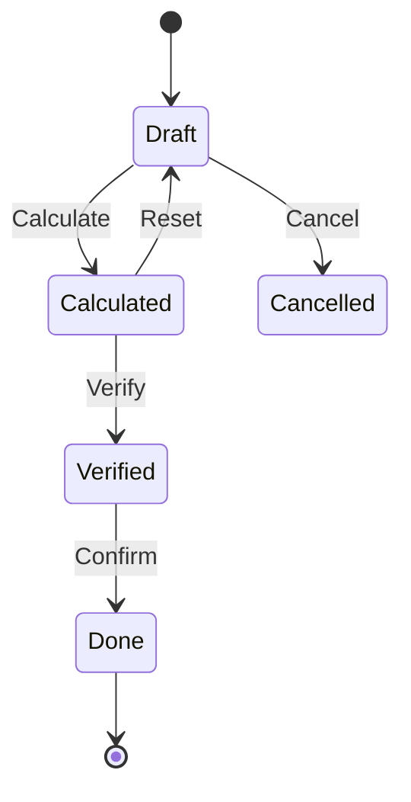
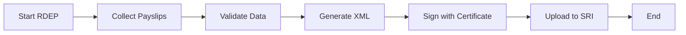
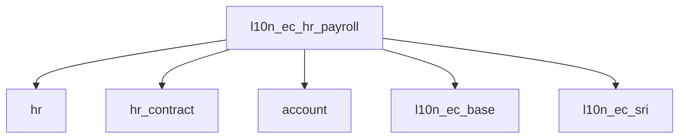

# SRS: SOMATECH ECUADOR HR PAYROLL MODULE
> **Complete Payroll & Labor Compliance System**
> **Version 1.0** | 2026-01-24 | ISO 9001:2015 Compliant Documentation

---

# DOCUMENT CONTROL

| Property | Value |
|----------|-------|
| **Document ID** | SRS-HRPAY-EC-001 |
| **Version** | 1.0 |
| **Status** | Draft |
| **Classification** | Internal |
| **Author** | Somatech Development Team |
| **Reviewers** | Legal, HR, Accounting |

| Version | Date | Author | Changes |
|---------|------|--------|---------|
| 1.0 | 2026-01-24 | Somatech | Initial SRS |

---

# 1. EXECUTIVE SUMMARY

## 1.1 Purpose

This Software Requirements Specification (SRS) defines all requirements for the **Ecuador HR Payroll Module** (l10n_ec_hr_payroll) for Odoo 18. The module provides complete payroll processing compliant with:

- **Código de Trabajo** (Labor Code)
- **IESS** (Instituto Ecuatoriano de Seguridad Social)
- **SRI** (Servicio de Rentas Internas)
- **Ministerio de Trabajo**

## 1.2 Scope

```
┌─────────────────────────────────────────────────────────────────────┐
│                         MODULE SCOPE                                 │
├─────────────────────────────────────────────────────────────────────┤
│                                                                     │
│  ✅ Employee Management (Gestión de Personal)                      │
│  ✅ Contract Types & Regimes (Contratos y Regímenes)               │
│  ✅ Payroll Processing (Rol de Pagos)                              │
│  ✅ IESS Contributions (Aportes IESS)                              │
│  ✅ Legal Benefits (Beneficios de Ley)                             │
│  ✅ Income Tax Processing (Impuesto a la Renta)                    │
│  ✅ RDEP Generation (Anexo de Relación de Dependencia)             │
│  ✅ Formulario 107 Generation                                       │
│  ✅ MDT Reporting (Ministerio de Trabajo)                          │
│                                                                     │
│  ❌ NOT IN SCOPE: Voluntary benefits, Stock options                │
│                                                                     │
└─────────────────────────────────────────────────────────────────────┘
```

## 1.3 Architecture Principle

```
┌─────────────────────────────────────────────────────────────────────┐
│                    ZERO HARDCODED VALUES                            │
├─────────────────────────────────────────────────────────────────────┤
│                                                                     │
│   ALL rates, thresholds, and parameters MUST be stored in          │
│   ir.config_parameter and retrieved at runtime.                    │
│                                                                     │
│   ❌ FORBIDDEN: salary = base * 0.0945  # hardcoded                 │
│   ✅ REQUIRED:  rate = get_param('l10n_ec.iess_personal')          │
│                 salary = base * (float(rate) / 100)                │
│                                                                     │
└─────────────────────────────────────────────────────────────────────┘
```

---

# 2. REGULATORY FRAMEWORK (ECUADOR 2026)

## 2.1 Governing Laws & Regulations

| Regulation | Authority | Scope |
|------------|-----------|-------|
| Código de Trabajo | Ministerio de Trabajo | Labor relations, benefits |
| Ley de Seguridad Social | IESS | Social security contributions |
| LORTI | SRI | Income tax, RDEP |
| Acuerdo MDT-2025-227 | Ministerio de Trabajo | SBU 2026 |
| Resolución CD 655 | IESS | Contribution rates |

## 2.2 Key Parameters (2026)

> [!CAUTION]
> All values below are stored in `ir.config_parameter`.
> Code MUST retrieve these dynamically. NO HARDCODING.

## 1.3 Key Legal Parameters (2026)

| Parameter | Value | Legal Basis |
|-----------|-------|-------------|
| **SBU 2026** | $482.00 | MDT Acuerdo 2025 |
| **IESS Personal** | 9.45% | Ley Seg. Social |
| **IESS Patronal** | 11.15% | Ley Seg. Social |
| **Salario Digno** | Calculated | Art. 95 CT |
| **Fondos Reserva** | 8.33% | Art. 196 CT |
| **Decimo 3ro** | 1/12 Earnings | Art. 111 CT |
| **Decimo 4to** | $482.00 | Art. 113 CT |
| **Recargo Nocturn**| 25% | Art. 55 CT |
| **Hora Suppl** | 50% | Art. 55 CT |
| **Hora Extra** | 100% | Art. 55 CT |
| **Utilidades** | 15% Net Income | Art. 97 CT |

---

# 2. DATA MODELS

## 2.1 Employee Extension (`hr.employee`)

| Field | Type | Description |
|-------|------|-------------|
| `l10n_ec_decimo13_accumulate` | Boolean | True = Receive in Dec; False = Monthly |
| `l10n_ec_decimo14_accumulate` | Boolean | True = Receive in Mar/Aug; False = Monthly |
| `l10n_ec_funds_reserve_accumulate` | Boolean | True = IESS; False = Monthly |
| `l10n_ec_disability_id` | Many2one | CONADIS Card info |
| `l10n_ec_dependents` | Integer | For Utility calculation (cargas) |
| `l10n_ec_region_id` | Selection | `costa`, `sierra` (For Dec 14th) |
| `l10n_ec_impuesto_renta_projection` | Float | Proyeccion Gastos Personales |

---

# 3. FUNCTIONAL LOGIC

## 3.1 Overtime & Shifts (Art. 55) (REVISED)
System MUST calculate strictly based on shift timestamps:
- **Jornada Ordinaria**: Max 8h/day, 40h/week.
- **Recargo Nocturno (25%)**: Work between 19:00 - 06:00 (within 8h).
- **Suplementaria (50%)**: >8h on weekdays (Max 4h/day, 12h/week).
- **Extraordinaria (100%)**: Work on Sat/Sun/Holidays OR >24:00.

**Algorithm:**
1. Check Global Leave/Public Holidays.
2. Check Employee Schedule.
3. Compare Attendance In/Out.
4. Split hours into buckets (Normal, Night, Supp, Extra).
5. Apply rates to `contract.wage / 240` (hourly rate).

## 3.2 Utilidades (Profit Sharing - Art. 97)
**Deadline**: April 15th.
 **Calculation:**
1. **10% (Employees)**: `(Net Income * 0.10) / Total Days Worked by All`.
   - Distribute based on individual days worked.
2. **5% (Cargas)**: `(Net Income * 0.05) / Total Factor A`.
   - Factor A = Days Worked * Number of Dependents.
   - Distribute based on individual Factor A.

## 3.3 Reserve Funds (Fondos de Reserva - Art. 196)
- **Eligibility**: From Month 13 of continuous work.
- **Rate**: 8.33% of *Remuneración de Aportación* (Base + Overtime + Commissions).
- **Payment**: IESS (Accumulated) or Monthly Roll.

## 3.4 Decimos (13th & 14th)
- **13th (Bono Navideño)**:
  - Period: Dec 1 - Nov 30.
  - Base: Sum of ALL taxable income / 12.
- **14th (Bono Escolar)**:
  - Period: Mar 1 - Feb 28 (Costa) / Aug 1 - Jul 31 (Sierra).
  - Base: 1 SBU ($482) / 360 * Days Worked.

## 3.5 Jubilación Patronal (Actuarial - Art. 216)
> [!NOTE]
> Odoo stores the *provision*, not the actuarial calculation itself.
- **Requirements**:
  - Track "Years of Service" accurately.
  - On 20+ years, trigger alert for provision review.
  - On termination (despido > 20y), trigger calculation wizard.

---

# 4. REPORTING REQUIREMENTS

## 4.1 RDEP (Relación de Dependencia)
XML Report for SRI (Annex).
- Must group income by type (Sueldo, Sobresueldo, Utilidades).
- Apply Gastos Personales deduction.
- Report "Impuesto Renta Asumido" if applicable.

## 4.2 IESS Planillas
- Generate .txt file for IESS upload.
- Updates status (Avisos de Entrada/Salida).

## 4.3 Formulario 107
- Printable withholding certificate for employees.
- Maps RDEP fields to PDF layout.

### 2.2.2 IESS Contribution Rates

| Type | Parameter | Rate | Key |
|------|-----------|------|-----|
| **Private Sector** | Personal | 9.45% | `l10n_ec.iess_aporte_personal` |
| **Private Sector** | Employer | 11.15% | `l10n_ec.iess_aporte_patronal` |
| **Public Sector** | Personal | 11.45% | `l10n_ec.iess_aporte_personal_publico` |
| **Public Sector** | Employer | 9.15% | `l10n_ec.iess_aporte_patronal_publico` |
| **Voluntary** | Total | 17.60% | `l10n_ec.iess_aporte_voluntario` |

### 2.2.3 Legal Benefits

| Benefit | Formula | Deadline | Key |
|---------|---------|----------|-----|
| **Décimo Tercero** | Total income / 12 | Dec 24 | `l10n_ec.decimo_tercero_divisor` |
| **Décimo Cuarto** | 1 SBU ($482) | Mar 15 / Aug 15 | Via SBU param |
| **Fondos de Reserva** | 8.33% | Monthly | `l10n_ec.fondos_reserva` |
| **Utilidades** | 15% (10% + 5%) | Apr 15 | `l10n_ec.utilidades_*` |
| **Vacaciones** | 15-30 days | - | `l10n_ec.vacaciones_*` |

### 2.2.4 Overtime & Surcharges

| Type | Surcharge | Key |
|------|-----------|-----|
| Supplementary (50%) | +50% | `l10n_ec.horas_suplementarias_recargo` |
| Extraordinary (100%) | +100% | `l10n_ec.horas_extraordinarias_recargo` |
| Night Work | +25% | `l10n_ec.trabajo_nocturno_recargo` |

### 2.2.5 Termination & Severance

| Type | Calculation | Key |
|------|-------------|-----|
| Despido Intempestivo (< 3 años) | 3 months | `l10n_ec.despido_meses_hasta_3_años` |
| Despido Intempestivo (> 3 años) | 1 month/year (max 25) | `l10n_ec.despido_meses_max` |
| Desahucio | 25% last salary × years | `l10n_ec.desahucio_porcentaje` |

---

# 3. FUNCTIONAL REQUIREMENTS

## 3.1 Employee Management (HR-EMP)

### 3.1.1 Employee Profile Extension

| Field | Type | Description | SRI/IESS Required |
|-------|------|-------------|-------------------|
| `l10n_ec_cedula` | Char | Cédula de Identidad | ✅ Yes |
| `l10n_ec_identification_type` | Selection | C/R/P (Cédula/RUC/Pasaporte) | ✅ Yes |
| `l10n_ec_sectorial_code` | Char | Código Sectorial IESS | ✅ Yes |
| `l10n_ec_iess_affiliate_type` | Selection | Type of IESS affiliation | ✅ Yes |
| `l10n_ec_disability_percentage` | Float | Disability % (if applicable) | ✅ Yes |
| `l10n_ec_has_dependents` | Boolean | Has dependent family members | ✅ Yes |
| `l10n_ec_dependent_count` | Integer | Number of dependents | ✅ Yes |
| `l10n_ec_region` | Selection | Sierra/Costa/Oriente/Galápagos | ✅ Yes (14th) |
| `l10n_ec_projected_expenses` | Float | Projected personal expenses | ✅ Yes (Tax) |

### 3.1.2 Identification Types

| Code | Type | Validation |
|------|------|------------|
| `C` | Cédula | 10 digits, mod 10 check |
| `R` | RUC | 13 digits, starts with cédula |
| `P` | Pasaporte | Alphanumeric |

### 3.1.3 IESS Affiliate Types

| Code | Type | Notes |
|------|------|-------|
| `general` | Afiliado General | Standard private sector |
| `voluntario` | Afiliado Voluntario | Self-employed |
| `domestico` | Trabajo Doméstico | Household workers |
| `jornalero` | Jornalero | Day laborers |
| `artesano` | Artesano Calificado | Registered artisans |
| `publico` | Sector Público | Government employees |

## 3.2 Contract Management (HR-CON)

### 3.2.1 Contract Model Extension

| Field | Type | Description |
|-------|------|-------------|
| `l10n_ec_contract_type` | Selection | Type of contract |
| `l10n_ec_regime` | Selection | IESS regime |
| `l10n_ec_sectorial_table` | Many2one | Sectorial salary table |
| `l10n_ec_accumulate_13` | Boolean | Accumulate 13th |
| `l10n_ec_accumulate_14` | Boolean | Accumulate 14th |
| `l10n_ec_accumulate_reserve` | Boolean | Accumulate Reserve Funds |
| `l10n_ec_work_schedule` | Selection | Full/Part time |
| `l10n_ec_trial_period` | Boolean | In trial period |
| `l10n_ec_trial_end_date` | Date | Trial period end |

### 3.2.2 Contract Types

| Code | Type | Duration | Notes |
|------|------|----------|-------|
| `indefinido` | Indefinido | No end | Standard |
| `fijo` | Plazo Fijo | Max 2 years | Special cases |
| `eventual` | Eventual | Max 180 days | Peak demand |
| `ocasional` | Ocasional | Max 30 days | Specific tasks |
| `temporal` | Temporal | Variable | Seasonal |
| `aprendizaje` | Aprendizaje | 1 year | Training |
| `pasantia` | Pasantía | 6 months | Internship |
| `prueba` | Periodo de Prueba | 90 days | Trial period |

### 3.2.3 Work Schedules

| Code | Hours/Week | IESS Calculation |
|------|------------|------------------|
| `full_time` | 40 | Full contribution |
| `part_time` | < 40 | Proportional |
| `reduced` | Variable | Per agreement |

## 3.3 Payroll Processing (HR-PAY)

### 3.3.1 Payslip Model: `l10n_ec.payslip`

#### Header Fields

| Field | Type | Description |
|-------|------|-------------|
| `name` | Char | Payslip reference |
| `employee_id` | Many2one | Employee |
| `contract_id` | Many2one | Active contract |
| `date_from` | Date | Period start |
| `date_to` | Date | Period end |
| `days_worked` | Float | Days worked |
| `state` | Selection | Draft/Verified/Done/Cancelled |

#### Income Fields (Ingresos)

| Field | Type | Description | Taxable |
|-------|------|-------------|---------|
| `wage` | Monetary | Base salary | ✅ Yes |
| `overtime_50` | Monetary | Overtime 50% | ✅ Yes |
| `overtime_100` | Monetary | Overtime 100% | ✅ Yes |
| `night_surcharge` | Monetary | Night work surcharge | ✅ Yes |
| `commissions` | Monetary | Commissions | ✅ Yes |
| `bonuses` | Monetary | Discretionary bonuses | ✅ Yes |
| `other_income` | Monetary | Other taxable income | ✅ Yes |
| **`total_income`** | Monetary | **Total earnings** | - |

#### Benefit Fields (Provisiones)

| Field | Type | Description | Taxable |
|-------|------|-------------|---------|
| `thirteenth` | Monetary | Décimo Tercero provision | ❌ No |
| `fourteenth` | Monetary | Décimo Cuarto provision | ❌ No |
| `reserve_funds` | Monetary | Fondos de Reserva | ❌ No |
| `vacation_accrual` | Monetary | Vacation accrual | ❌ No |

#### Deduction Fields (Deducciones)

| Field | Type | Description |
|-------|------|-------------|
| `iess_personal` | Monetary | IESS employee contribution |
| `iess_loans` | Monetary | IESS loan payments |
| `income_tax` | Monetary | Impuesto a la Renta |
| `judicial_retention` | Monetary | Judicial withholdings |
| `salary_advances` | Monetary | Salary advances |
| `other_deductions` | Monetary | Other deductions |
| **`total_deductions`** | Monetary | **Total deductions** |

#### Employer Cost Fields (Costos Patronales)

| Field | Type | Description |
|-------|------|-------------|
| `iess_employer` | Monetary | IESS employer contribution |
| `iess_secap_iece` | Monetary | SECAP/IECE contributions |
| **`total_employer_cost`** | Monetary | **Total employer cost** |

#### Net Pay

| Field | Type | Calculation |
|-------|------|-------------|
| `net_pay` | Monetary | total_income - total_deductions |
| `total_cost` | Monetary | total_income + total_employer_cost |

### 3.3.2 Payslip State Machine



### 3.3.3 Calculation Logic

```python
# PSEUDOCODE - Actual implementation uses ir.config_parameter

def compute_payslip(payslip):
    ICP = env['ir.config_parameter'].sudo()

    # Get rates - MUST raise error if missing
    iess_personal_rate = get_required_param('l10n_ec.iess_aporte_personal')
    iess_employer_rate = get_required_param('l10n_ec.iess_aporte_patronal')
    sbu = get_required_param('l10n_ec.sbu')

    # Calculate total income
    total_income = (
        payslip.wage +
        payslip.overtime_50 +
        payslip.overtime_100 +
        payslip.commissions +
        payslip.bonuses
    )

    # IESS Contributions
    payslip.iess_personal = total_income * (iess_personal_rate / 100)
    payslip.iess_employer = total_income * (iess_employer_rate / 100)

    # Benefits (Provisions)
    payslip.thirteenth = total_income / 12
    payslip.fourteenth = (sbu / 360) * payslip.days_worked
    payslip.reserve_funds = total_income * 0.0833  # 1/12

    # Net Pay
    payslip.net_pay = total_income - payslip.iess_personal - payslip.income_tax
```

## 3.4 Income Tax Processing (HR-TAX)

### 3.4.1 Tax Calculation Requirements

| Requirement | Description |
|-------------|-------------|
| **Projection Method** | Annualized income projection |
| **Deductions** | IESS personal, projected expenses |
| **Tax Tables** | Annual tax brackets from SRI |
| **Formulario 107** | Year-end certificate generation |

### 3.4.2 Tax Brackets 2026

> [!IMPORTANT]
> Tax brackets per SRI **Resolución NAC-DGERCGC25-00000043** (29-dic-2025).
> These MUST be stored in `l10n_ec.income.tax.bracket` model.

**2026 Income Tax Table (Personas Naturales)**

| Fracción Básica | Exceso Hasta | Impuesto FB | % Excedente |
|-----------------|--------------|-------------|-------------|
| $0 | $12,208 | $0 | 0% |
| $12,208 | $15,549 | $0 | 5% |
| $15,549 | $20,188 | $167 | 10% |
| $20,188 | $26,700 | $631 | 12% |
| $26,700 | $35,136 | $1,412 | 15% |
| $35,136 | $46,575 | $2,678 | 20% |
| $46,575 | $62,005 | $4,965 | 25% |
| $62,005 | $82,679 | $8,823 | 30% |
| $82,679 | $109,956 | $15,025 | 35% |
| $109,956 | En adelante | $24,572 | 37% |

**Key 2026 Change**: Base exenta increased to $12,208 (from $12,081 in 2025).

Model: `l10n_ec.income.tax.bracket`

| Field | Type | Description |
|-------|------|-------------|
| `year` | Integer | Fiscal year (2026) |
| `lower_limit` | Float | Fracción Básica |
| `upper_limit` | Float | Exceso Hasta |
| `base_tax` | Float | Impuesto Fracción Básica |
| `marginal_rate` | Float | % sobre Excedente |

### 3.4.3 Projected Personal Expenses 2026

| Category | Max Deduction |
|----------|---------------|
| Vivienda | Configurable |
| Educación | Configurable |
| Salud (with emphasis) | Configurable |
| Alimentación | Configurable |
| Vestimenta | Configurable |
| **Total** | Configurable (via `ir.config_parameter`) |

## 3.5 RDEP Generation (HR-RDEP)

### 3.5.1 Anexo RDEP Requirements

| Field | Description | Source |
|-------|-------------|--------|
| tipoIdentificacionEmpleado | ID type (C/R/P) | Employee |
| identificacionEmpleado | ID number | Employee |
| apellidos | Last names | Employee |
| nombres | First names | Employee |
| sueldosSalarios | Wages | Payslips sum |
| decimoTercer | 13th salary | Payslips sum |
| decimoCuarto | 14th salary | Payslips sum |
| fondosReserva | Reserve funds | Payslips sum |
| aportePersonalIESS | IESS personal | Payslips sum |
| impuestoRentaCausado | Income tax | Payslips sum |
| gastosPersonales | Personal expenses | Employee |
| numMeses | Months worked | Count |

### 3.5.2 Generation Process



### 3.5.3 Formulario 107

PDF certificate per employee containing:
- Employee identification
- Total income breakdown
- Total deductions
- Net income
- Tax withheld
- Employer certification

## 3.6 Ministerio de Trabajo Reports (HR-MDT)

### 3.6.1 Required Reports

| Report | Frequency | Deadline |
|--------|-----------|----------|
| Décimo Tercero | Annual | Dec 24 |
| Décimo Cuarto | Annual | Mar 15 / Aug 15 |
| Utilidades | Annual | Apr 15 |
| Actas de Finiquito | Per termination | 15 days |

### 3.6.2 Integration with SUT

Sistema Único de Trabajo (SUT) integration for:
- Contract registration
- Benefit payment reporting
- Termination records

---

# 4. NON-FUNCTIONAL REQUIREMENTS

## 4.1 Performance (NFR-PERF)

| Metric | Requirement |
|--------|-------------|
| Payroll calculation (1 employee) | < 500ms |
| Payroll calculation (100 employees) | < 5 seconds |
| RDEP generation (1000 employees) | < 30 seconds |
| Report generation | < 10 seconds |

## 4.2 Security (NFR-SEC)

| Requirement | Implementation |
|-------------|----------------|
| Role-based access | HR Manager, HR User, Payroll Admin |
| Salary data encryption | At rest and in transit |
| Audit trail | All payroll modifications logged |
| Data retention | 7 years minimum (SRI requirement) |
| PII protection | Cédula masked in logs |

## 4.3 Compliance (NFR-COMP)

| Regulation | Requirement |
|------------|-------------|
| Código de Trabajo | All benefit calculations |
| LORTI | Tax withholding, RDEP |
| Ley de Seguridad Social | IESS contributions |
| LOPD | Personal data protection |

## 4.4 Usability (NFR-USE)

| Requirement | Description |
|-------------|-------------|
| Spanish UI | All labels in Spanish |
| PDF reports | Standard A4 format |
| Excel export | For auditing |
| Batch processing | Multi-employee payroll |

## 4.5 Reliability (NFR-REL)

| Requirement | Target |
|-------------|--------|
| Calculation accuracy | 100% (0 tolerance for errors) |
| System uptime | 99.9% |
| Backup frequency | Daily |
| Recovery time | < 4 hours |

---

# 5. USER INTERFACE REQUIREMENTS

## 5.1 Dashboard

```
┌─────────────────────────────────────────────────────────────────────┐
│  👥 PAYROLL DASHBOARD - January 2026                                │
├─────────────────────────────────────────────────────────────────────┤
│                                                                     │
│  📊 PERIOD SUMMARY                                                  │
│  ┌──────────────┬──────────────┬──────────────┬──────────────┐     │
│  │ Employees    │ Total Wages  │ Total IESS   │ Net Payroll  │     │
│  │     156      │   $95,450    │   $18,640    │   $76,810    │     │
│  └──────────────┴──────────────┴──────────────┴──────────────┘     │
│                                                                     │
│  ⚠️ PENDING ACTIONS                                                 │
│  • 12 payslips awaiting verification                               │
│  • Décimo Cuarto payment due: Aug 15                               │
│  • RDEP submission : Jan 28                                        │
│                                                                     │
│  📅 UPCOMING DEADLINES                                              │
│  • IESS monthly upload: Jan 31                                     │
│  • Formulario 107 delivery: Jan 31                                 │
│                                                                     │
└─────────────────────────────────────────────────────────────────────┘
```

## 5.2 Payslip Form

Key sections:
1. **Header** - Employee, period, contract
2. **Income** - All earnings breakdown
3. **Benefits** - Provisions (13th, 14th, reserve)
4. **Deductions** - IESS, tax, other
5. **Summary** - Net pay, employer cost
6. **History** - Past payslips

## 5.3 Batch Processing

Wizard for processing multiple payslips:
1. Select period
2. Select employees/departments
3. Calculate all
4. Review exceptions
5. Confirm batch

---

# 6. CONFIGURATION

## 6.1 System Parameters

All Ecuador payroll parameters in `ir.config_parameter`:

| Key | Description | Type |
|-----|-------------|------|
| `l10n_ec.sbu` | Salario Básico Unificado | Float |
| `l10n_ec.iess_aporte_personal` | IESS Personal % | Float |
| `l10n_ec.iess_aporte_patronal` | IESS Employer % | Float |
| `l10n_ec.fondos_reserva` | Reserve Funds % | Float |
| `l10n_ec.decimo_tercero_divisor` | 13th divisor | Integer |
| `l10n_ec.vacaciones_dias_base` | Vacation days | Integer |
| `l10n_ec.horas_suplementarias_recargo` | OT 50% surcharge | Float |
| `l10n_ec.horas_extraordinarias_recargo` | OT 100% surcharge | Float |
| `l10n_ec.trabajo_nocturno_recargo` | Night surcharge | Float |

## 6.2 Accounting Configuration

| Setting | Account |
|---------|---------|
| Salary Expense | 6.1.x.x |
| IESS Employer Expense | 6.1.x.x |
| IESS Personal Payable | 2.1.x.x |
| IESS Employer Payable | 2.1.x.x |
| Salary Payable | 2.1.x.x |
| Provisions (13th, 14th) | 2.1.x.x |
| Income Tax Payable | 2.1.x.x |

---

# 7. INTEGRATION POINTS

## 7.1 Module Dependencies



## 7.2 External Integrations

| System | Integration | Priority |
|--------|-------------|----------|
| IESS Portal | Contribution upload | Phase 2 |
| SRI RDEP | XML submission | Phase 1 |
| SUT | Contract registration | Phase 2 |
| Banking | Payment files | Phase 2 |

---

# 8. REPORTS

## 8.1 Required Reports

| Report | Format | Regulatory |
|--------|--------|------------|
| Rol de Pagos Individual | PDF | ✅ |
| Rol de Pagos Consolidado | PDF/Excel | ✅ |
| Planilla IESS | Excel | ✅ |
| RDEP Anexo | XML | ✅ |
| Formulario 107 | PDF | ✅ |
| Acta de Finiquito | PDF | ✅ |
| Décimos Report | PDF | ✅ |
| Utilidades Report | PDF | ✅ |

## 8.2 Report Templates

All reports follow MDT/SRI official formats where applicable.

---

# 9. TESTING REQUIREMENTS

## 9.1 Unit Tests

| Test ID | Description |
|---------|-------------|
| UT-001 | IESS personal calculation |
| UT-002 | IESS employer calculation |
| UT-003 | Décimo tercero calculation |
| UT-004 | Décimo cuarto calculation |
| UT-005 | Reserve funds calculation |
| UT-006 | Overtime 50% calculation |
| UT-007 | Overtime 100% calculation |
| UT-008 | Income tax calculation |
| UT-009 | Net pay calculation |

## 9.2 Integration Tests

| Test ID | Description |
|---------|-------------|
| IT-001 | Payslip to accounting entries |
| IT-002 | RDEP XML generation |
| IT-003 | Formulario 107 generation |
| IT-004 | Contract to payslip flow |

## 9.3 Regulatory Tests

| Test ID | Description |
|---------|-------------|
| RT-001 | All rates from config (no hardcoding) |
| RT-002 | IESS rates match official 2026 |
| RT-003 | SBU value matches MDT 2026 |
| RT-004 | Tax tables match SRI 2026 |

---

# 10. IMPLEMENTATION PHASES

## Phase 1: Core (MVP)

- [ ] Employee extensions
- [ ] Contract extensions
- [ ] Basic payslip model
- [ ] IESS calculations
- [ ] Décimos calculations
- [ ] Basic rol de pagos report

## Phase 2: Tax & Reporting

- [ ] Income tax calculation
- [ ] RDEP generation
- [ ] Formulario 107
- [ ] Accounting integration

## Phase 3: Advanced

- [ ] Bulk processing
- [ ] IESS portal integration
- [ ] Banking integration
- [ ] Analytics dashboard

---

# 11. ACCEPTANCE CRITERIA

## 11.1 Functional Criteria

| Criteria | Test |
|----------|------|
| Payslip calculates correctly | Manual verification vs Excel |
| IESS amounts match formula | |rate × base = amount |
| Décimos calculated per law | 12th of income / SBU |
| RDEP generates valid XML | SRI schema validation |
| F107 contains correct data | Manual audit |

## 11.2 Non-Functional Criteria

| Criteria | Target |
|----------|--------|
| Zero hardcoded values | Audit all calculations |
| All text in Spanish | UI review |
| PDF reports print correctly | Print test |
| Payroll under 5 seconds | Performance test |

---

# 12. GLOSSARY

| Term | Definition |
|------|------------|
| **SBU** | Salario Básico Unificado |
| **IESS** | Instituto Ecuatoriano de Seguridad Social |
| **SRI** | Servicio de Rentas Internas |
| **RDEP** | Retenciones en la Fuente bajo Relación de Dependencia |
| **Décimo Tercero** | 13th salary (Christmas bonus) |
| **Décimo Cuarto** | 14th salary (School bonus) |
| **Fondos de Reserva** | Reserve funds (8.33%) |
| **Utilidades** | Profit sharing (15%) |
| **MDT** | Ministerio de Trabajo |
| **SUT** | Sistema Único de Trabajo |
| **LORTI** | Ley Orgánica de Régimen Tributario Interno |

---

# 13. REFERENCES

| Source | URL |
|--------|-----|
| Código de Trabajo | https://www.trabajo.gob.ec |
| IESS | https://www.iess.gob.ec |
| SRI | https://www.sri.gob.ec |
| SUT | https://sut.trabajo.gob.ec |

---

# 14. APPENDICES

## Appendix A: Sample Payslip Calculation

**Employee**: Juan Pérez
**Base Salary**: $800.00
**Period**: January 2026

| Concept | Amount |
|---------|--------|
| Base Salary | $800.00 |
| Overtime 50% (10 hrs) | $62.50 |
| **Total Income** | **$862.50** |
| | |
| IESS Personal (9.45%) | -$81.51 |
| Income Tax | -$15.00 |
| **Total Deductions** | **-$96.51** |
| | |
| **Net Pay** | **$765.99** |
| | |
| IESS Employer (11.15%) | $96.17 |
| 13th Provision | $71.88 |
| 14th Provision | $40.17 |
| Reserve Funds | $71.85 |
| **Total Employer Cost** | **$1,142.57** |

---

**Document Control**

| Approval | Name | Date | Signature |
|----------|------|------|-----------|
| Author | Dev Team | 2026-01-24 | - |
| Reviewer | Legal | - | - |
| Approver | PM | - | - |


# 13. COMPETITIVE SUPERIORITY REQUIREMENTS (SRS-10)
> **Goal**: Surpass market standard (PacERP) via Native Odoo Features.

## 13.1 Employee Self-Service Portal (SRS-10-PORTAL)
**Objective**: Eliminate HR bottlenecks for document retrieval.

| Requirement | Description | User Story |
|-------------|-------------|------------|
| **PDF Download** | Employees must be able to download their signed "Rol de Pagos" PDF. | "As Juan, I want to download my Jan slip to apply for a loan." |
| **Loan Balance** | Employees can view real-time balance of Company/IESS loans. | "As Maria, I want to see how much I still owe." |
| **Mobile Native** | Interface must be fully responsive (Phone/Tablet). | "I want to check payroll on the bus." |

## 13.2 Automated Attendance & Overtime (SRS-10-ATTEND)
**Objective**: Eliminate manual data entry errors in Overtime.

| Requirement | Description | Logic |
|-------------|-------------|-------|
| **Biometric Sync** | Integrate with `hr_attendance` (FaceID/Kiosk). | Check-In/Out timestamps act as source of truth. |
| **Auto-Calculation** | System auto-computes 50% vs 100% hours based on shifts. | `Hours = Checkout - Checkin`. Match against `Shift`. Excess = OT. |
| **Approval Flow** | Manager approves "Calculated OT" before Payroll linkage. | Prevent unauthorized overtime payment. |

---
