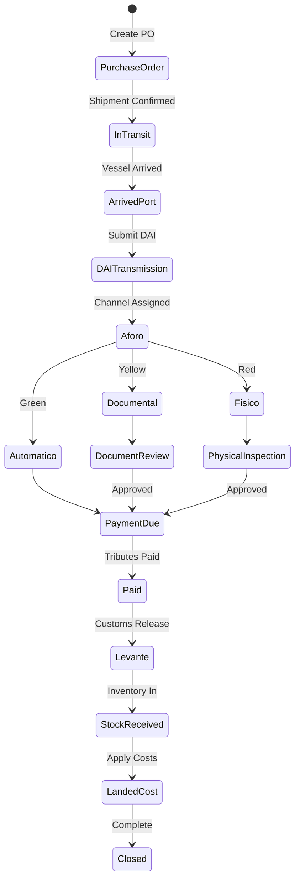
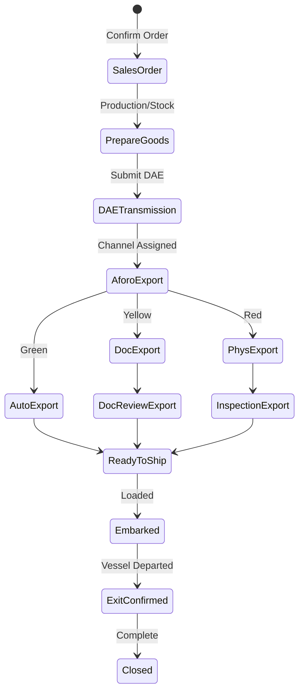
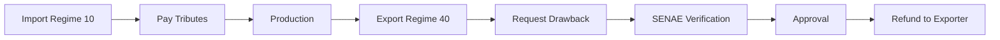
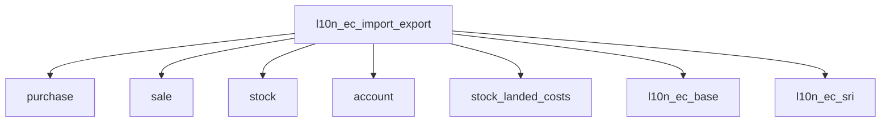

# SRS: SOMATECH ECUADOR IMPORT/EXPORT MANAGEMENT MODULE
> **Complete Customs & Foreign Trade System - COPCI Compliant**
> **Version 2.0** | 2026-01-24 | ISO 9001:2015 Documentation

---

# DOCUMENT CONTROL

| Property | Value |
|----------|-------|
| **Document ID** | SRS-IMPEXP-EC-002 |
| **Version** | 2.0 |
| **Status** | Draft |
| **Classification** | Internal |
| **Legal Basis** | COPCI (R.O. Suplemento 351, 29-dic-2010) |
| **Regulatory Authority** | SENAE |

---

# 1. LEGAL FRAMEWORK

## 1.1 Primary Legislation

| Law | Official Citation | Scope |
|-----|-------------------|-------|
| **COPCI** | Código Orgánico de la Producción, Comercio e Inversiones | All foreign trade |
| **Reglamento COPCI** | Decreto Ejecutivo 758 (R.O. 452, 19-may-2011) | Procedural |
| **Resoluciones SENAE** | Variable | Operational |

> [!CAUTION]
> **LEGAL PRINCIPLE**: Any duty, tax, or salvaguardia is ONLY valid when published in
> **Registro Oficial de Ecuador**. News sources, announcements, or decrees are NOT
> sufficient until Registro Oficial publication.

## 1.2 COPCI Structure (Relevant Articles)

### Book V: External Trade & Customs Facilitation

| Chapter | Articles | Content |
|---------|----------|---------|
| Title I | Art. 103-107 | General provisions |
| Title II | Art. 108-146 | Customs regimes |
| Title III | Art. 147-162 | Customs procedures |
| Title IV | Art. 163-210 | Customs obligations |
| Title V | Art. 211-236 | Export incentives |

---

# 2. CUSTOMS REGIMES (COPCI Title II)

## 2.1 Import Regimes

### Regime 10: Importación para el Consumo
**Art. 120 COPCI**

| Attribute | Value |
|-----------|-------|
| **Code** | 10 |
| **Purpose** | Definitive entry for free circulation |
| **Tributes** | All duties and taxes payable |
| **Result** | Merchandise nationalized |

```
┌─────────────────────────────────────────────────────────────────────┐
│  REGIME 10 FLOW: IMPORTACIÓN PARA EL CONSUMO                       │
├─────────────────────────────────────────────────────────────────────┤
│                                                                     │
│  Arrival → DAI Transmission → Aforo → Payment → Levante → Free    │
│                                                                     │
│  Tributes: Ad Valorem + FODINFA + IVA + ISD (if applicable)        │
│                                                                     │
└─────────────────────────────────────────────────────────────────────┘
```

---

### Regime 20: Admisión Temporal para Reexportación en el Mismo Estado
**Art. 121-123 COPCI**

| Attribute | Value |
|-----------|-------|
| **Code** | 20 |
| **Purpose** | Temporary entry (specific purpose) |
| **Tributes** | Total or partial suspension |
| **Max Duration** | 2 years (extendable) |
| **Condition** | Must reexport without modification |

**Uses**: Machinery for events, samples, professional equipment, containers

---

### Regime 21: Admisión Temporal para Perfeccionamiento Activo
**Art. 124-128 COPCI**

| Attribute | Value |
|-----------|-------|
| **Code** | 21 |
| **Purpose** | Import for transformation/processing |
| **Tributes** | Suspended during processing |
| **Max Duration** | 1 year (extendable to 2) |
| **Condition** | Must export finished product |

**Uses**: Maquila, repair, assembly, packaging

**Subregimes**:
- 21.1: Transformation (manufacturing)
- 21.2: Repair/Restoration
- 21.3: Assembly

---

### Regime 70: Depósito Aduanero
**Art. 129-132 COPCI**

| Attribute | Value |
|-----------|-------|
| **Code** | 70 |
| **Purpose** | Storage under customs control |
| **Tributes** | Suspended during storage |
| **Max Duration** | 1 year |
| **Types** | Public (DA+) or Private (DA-) |

**Exits from Regime 70**:
- To Regime 10 (nationalization)
- To Regime 60 (reexportation)
- To Regime 40 (export)

---

### Regime 71: Depósito Aduanero Industrial
**Art. 132 COPCI**

| Attribute | Value |
|-----------|-------|
| **Code** | 71 |
| **Purpose** | Storage + industrial processing |
| **Tributes** | Suspended |
| **Special** | Transformation allowed |

---

## 2.2 Export Regimes

### Regime 40: Exportación Definitiva
**Art. 133-135 COPCI**

| Attribute | Value |
|-----------|-------|
| **Code** | 40 |
| **Purpose** | Definitive exit of goods |
| **Tributes** | Generally exempt |
| **Document** | DAE (Declaración Aduanera de Exportación) |

```
┌─────────────────────────────────────────────────────────────────────┐
│  REGIME 40 FLOW: EXPORTACIÓN DEFINITIVA                            │
├─────────────────────────────────────────────────────────────────────┤
│                                                                     │
│  Commercial Invoice → DAE Transmission → Aforo → Embarque → Exit   │
│                                                                     │
│  Requirements: RUC, ECUAPASS registration, export permit (if any)  │
│                                                                     │
└─────────────────────────────────────────────────────────────────────┘
```

---

### Regime 50: Exportación Temporal para Reimportación en el Mismo Estado
**Art. 136-137 COPCI**

| Attribute | Value |
|-----------|-------|
| **Code** | 50 |
| **Purpose** | Temporary export (specific purpose) |
| **Max Duration** | 2 years |
| **Condition** | Must reimport without modification |

**Uses**: Equipment for trade shows, samples, tools

---

### Regime 51: Exportación Temporal para Perfeccionamiento Pasivo
**Art. 138-140 COPCI**

| Attribute | Value |
|-----------|-------|
| **Code** | 51 |
| **Purpose** | Export for processing abroad |
| **Max Duration** | 1 year |
| **Condition** | Reimport processed goods |

**Uses**: Repair abroad, transformation, finishing

---

### Regime 60: Reexportación
**Art. 141 COPCI**

| Attribute | Value |
|-----------|-------|
| **Code** | 60 |
| **Purpose** | Exit of goods under temporary regimes |
| **Origin** | From Regime 20, 21, 70, 71 |
| **Tributes** | None (were suspended) |

---

## 2.3 Special Regimes

### ZEDE (Zonas Especiales de Desarrollo Económico)
**Arts. 34-42 COPCI**

| Attribute | Value |
|-----------|-------|
| **Purpose** | Investment attraction zones |
| **Types** | Industrial, Logistic, Technology |
| **Tax Benefits** | Multiple exemptions |
| **Customs** | Considered extraterritorial |

**ZEDE Entry/Exit Regimes**:
- From exterior → ZEDE (no tributes)
- ZEDE → Exterior (no tributes)
- ZEDE → National territory = Regime 10

---

### Drawback (Devolución Condicionada)
**Art. 154 COPCI**

| Attribute | Value |
|-----------|-------|
| **Purpose** | Refund of import tributes |
| **Condition** | Raw materials incorporated in exports |
| **Beneficiary** | Registered exporters |
| **Deadline** | Within 12 months of export |

**Calculation**: Tributes paid × percentage incorporated in export

---

## 2.4 Complete Regime Code Table

| Code | Name | Type | Art. COPCI |
|------|------|------|------------|
| **10** | Importación para el Consumo | Import | 120 |
| **20** | Admisión Temporal Mismo Estado | Import | 121-123 |
| **21** | Admisión Temporal Perfeccionamiento Activo | Import | 124-128 |
| **40** | Exportación Definitiva | Export | 133-135 |
| **50** | Exportación Temporal Mismo Estado | Export | 136-137 |
| **51** | Exportación Temporal Perfeccionamiento Pasivo | Export | 138-140 |
| **60** | Reexportación | Exit | 141 |
| **70** | Depósito Aduanero | Special | 129-132 |
| **71** | Depósito Aduanero Industrial | Special | 132 |
| **72** | Almacén Libre | Special | - |
| **80** | Tránsito Aduanero | Transit | 142-145 |
| **81** | Trasbordo | Transit | - |
| **90** | Correos/Mensajería | Special | - |
| **91** | Régimen 4x4 | Special | Res. SENAE |

---

# 3. TRIBUTES (COPCI Title IV)

## 3.1 Import Tributes

| Tribute | Legal Basis | Rate | Base |
|---------|-------------|------|------|
| **Aranceles Ad Valorem** | Art. 76 COPCI | 0-40% | CIF |
| **Aranceles Específicos** | Art. 76 COPCI | $/unit | Quantity |
| **FODINFA** | Ley INNFA | 0.5% | CIF |
| **IVA Importación** | LORTI Art. 52 | 15% | CIF + Duties + FODINFA |
| **ICE** | LORTI | Variable | CIF + Duties |
| **ISD** | LORTI Art. 156 | 5% | Payments abroad |
| **Salvaguardias** | Art. 88-89 COPCI | Variable | Per R.O. |

> [!IMPORTANT]
> ALL rates MUST be configured in `ir.config_parameter`.
> Salvaguardias are ONLY valid when published in **Registro Oficial**.

## 3.2 IVA Calculation Formula

```
IVA Import = (CIF + Ad Valorem + Specific Duty + Salvaguardia + FODINFA) × 15%
```

## 3.3 Tax Credit

IVA paid on imports → `IVA Crédito Tributario`
→ Offset against sales IVA
→ Report in Formulario 104

---

# 4. FUNCTIONAL REQUIREMENTS

## 4.1 Import Order Model (l10n_ec.import)

### 4.1.1 Header Fields

| Field | Type | Description | Required |
|-------|------|-------------|----------|
| `name` | Char | Sequential number | Auto |
| `date` | Date | Import date | Yes |
| `regime_id` | Selection | COPCI regime code | Yes |
| `dau_number` | Char | DAI number from SENAE | Yes |
| `supplier_id` | Many2one | Foreign supplier | Yes |
| `broker_id` | Many2one | Customs agent | Conditional |
| `incoterm_id` | Many2one | Incoterm | Yes |
| `origin_country_id` | Many2one | Country of origin | Yes |
| `aforo_channel` | Selection | Automatic/Doc/Físico | Auto |
| `state` | Selection | Workflow state | Auto |

### 4.1.2 Value Fields

| Field | Type | Calculation |
|-------|------|-------------|
| `fob_value` | Monetary | Sum of lines |
| `freight` | Monetary | Manual |
| `insurance` | Monetary | Manual or % |
| `cif_value` | Monetary | FOB + Freight + Insurance |
| `total_ad_valorem` | Monetary | Per tariff |
| `total_specific` | Monetary | Per tariff |
| `total_fodinfa` | Monetary | CIF × 0.5% |
| `total_salvaguardia` | Monetary | Per R.O. config |
| `iva_base` | Monetary | CIF + duties + FODINFA |
| `total_iva` | Monetary | Base × 15% |
| `total_tributos` | Monetary | All taxes |
| `total_nacionalizado` | Monetary | CIF + tributos + expenses |

### 4.1.3 Regime Selection

| Regime | Shows Fields |
|--------|--------------|
| 10 | All tributes, landed cost |
| 20 | Suspension calculation, guarantee |
| 21 | Transformation tracking |
| 70 | Storage dates, location |

## 4.2 Export Order Model (l10n_ec.export)

### 4.2.1 Header Fields

| Field | Type | Description | Required |
|-------|------|-------------|----------|
| `name` | Char | Sequential number | Auto |
| `date` | Date | Export date | Yes |
| `regime_id` | Selection | Export regime code | Yes |
| `dae_number` | Char | DAE number from SENAE | Yes |
| `customer_id` | Many2one | Foreign buyer | Yes |
| `incoterm_id` | Many2one | Incoterm | Yes |
| `destination_country_id` | Many2one | Destination | Yes |
| `state` | Selection | Workflow state | Auto |

### 4.2.2 Value Fields

| Field | Type | Description |
|-------|------|-------------|
| `fob_value` | Monetary | Export FOB value |
| `freight_export` | Monetary | Freight (if CIF/CFR) |
| `insurance_export` | Monetary | Insurance (if CIF) |
| `total_value` | Monetary | Based on Incoterm |

### 4.2.3 Export Incentives

| Field | Type | Description |
|-------|------|-------------|
| `drawback_eligible` | Boolean | Qualifies for drawback |
| `drawback_amount` | Monetary | Calculated refund |
| `certificate_origin` | Binary | Origin certificate |

## 4.3 Tariff Heading Model (l10n_ec.tariff.heading)

| Field | Type | Description |
|-------|------|-------------|
| `code` | Char | HS Code (10 digits) |
| `name` | Text | Description (ES) |
| `name_en` | Text | Description (EN) |
| `ad_valorem` | Float | Ad valorem rate |
| `specific_rate` | Float | Specific duty |
| `specific_unit` | Selection | kg/unit/liter |
| `ice_rate` | Float | ICE if applicable |
| `fodinfa_exempt` | Boolean | FODINFA exempt |
| `iva_exempt` | Boolean | IVA exempt |
| `requires_permit` | Boolean | Needs import permit |
| `permit_authority` | Char | AGROCALIDAD/ARCSA/etc |
| `restrictions` | Text | Country/origin restrictions |
| `valid_from` | Date | Effective date |
| `valid_to` | Date | Expiration date |

## 4.4 Customs Agent Model (l10n_ec.customs.broker)

| Field | Type | Description |
|-------|------|-------------|
| `partner_id` | Many2one | Contact |
| `license_number` | Char | SENAE license |
| `license_valid_until` | Date | Expiration |
| `license_status` | Selection | Active/Suspended/Revoked |
| `district` | Selection | SENAE district |

> [!WARNING]
> **Art. 227 COPCI**: Only licensed agents may transmit DAI.
> System MUST validate `license_status = 'active'` before transmission.

---

# 5. PROCESSES

## 5.1 Import Process (Regime 10)



## 5.2 Export Process (Regime 40)



## 5.3 Drawback Process



---

# 6. INTEGRATION

## 6.1 ECUAPASS Integration

| Service | Direction | Document |
|---------|-----------|----------|
| DAI Transmission | Outbound | Import declaration |
| DAE Transmission | Outbound | Export declaration |
| DAI Response | Inbound | Channel, status |
| DAE Response | Inbound | Approval, DAE number |
| Levante | Inbound | Release authorization |

## 6.2 Module Dependencies



---

# 7. CONFIGURATION

## 7.1 System Parameters

| Key | Description | Source |
|-----|-------------|--------|
| `l10n_ec.fodinfa` | FODINFA rate | Ley INNFA |
| `l10n_ec.customs_iva` | IVA import rate | LORTI |
| `l10n_ec.isd_rate` | ISD rate | LORTI |
| `l10n_ec.drawback_max_months` | Drawback deadline | COPCI |
| `l10n_ec.regime_20_max_days` | Temp import max | COPCI Art. 122 |
| `l10n_ec.regime_70_max_days` | Deposit max | COPCI Art. 130 |

> [!CAUTION]
> **ZERO HARDCODED VALUES**
> All configuration MUST be via `ir.config_parameter`.
> Code MUST raise ValidationError if configuration is missing.

---

# 8. REPORTS

## 8.1 Required Reports

| Report | Purpose | Authority |
|--------|---------|-----------|
| **Import Summary** | Per-import detail | Internal |
| **Export Summary** | Per-export detail | Internal |
| **Tributes Report** | Tax summary | SRI |
| **ATS Import** | Casilleros 401-405 | SRI |
| **Drawback Report** | Refund tracking | SENAE |
| **Regime Control** | Temp regime compliance | SENAE |

---

# 9. LEGAL COMPLIANCE CHECKLIST

## 9.1 COPCI Compliance

| Article | Requirement | Implementation |
|---------|-------------|----------------|
| Art. 120 | Regime 10 procedures | ✅ Regime model |
| Art. 124 | Regime 21 tracking | ✅ State machine |
| Art. 147 | DAI content | ✅ Field mapping |
| Art. 154 | Drawback calculation | ✅ Algorithm |
| Art. 227 | Agent license validation | ✅ Constraint |

## 9.2 Required Validations

| Validation | Legal Basis | Error Message |
|------------|-------------|---------------|
| Broker license active | Art. 227 COPCI | "Agente sin licencia activa" |
| HS code valid | Art. 147 COPCI | "Partida arancelaria inválida" |
| Tributes calculated | Art. 76 COPCI | "Tributos no calculados" |
| Origin declaration | Art. 158 COPCI | "Origen no declarado" |

---

# 10. GLOSSARY

| Term | Definition | Legal Basis |
|------|------------|-------------|
| **COPCI** | Código Orgánico de la Producción, Comercio e Inversiones | R.O. 351 |
| **SENAE** | Servicio Nacional de Aduana del Ecuador | Art. 108 COPCI |
| **DAI** | Declaración Aduanera de Importación | Art. 147 COPCI |
| **DAE** | Declaración Aduanera de Exportación | Art. 147 COPCI |
| **Aforo** | Customs inspection channel | Art. 149 COPCI |
| **Levante** | Customs release authorization | Art. 153 COPCI |
| **CIF** | Cost, Insurance, Freight | Incoterms 2020 |
| **FOB** | Free On Board | Incoterms 2020 |
| **Drawback** | Conditional refund of tributes | Art. 154 COPCI |
| **ZEDE** | Zona Especial de Desarrollo Económico | Art. 34 COPCI |

---

# 11. REFERENCES

| Source | Description | URL |
|--------|-------------|-----|
| COPCI | Full law text | lexis.com.ec |
| SENAE | Official customs portal | aduana.gob.ec |
| ECUAPASS | Electronic customs system | ecuapass.aduana.gob.ec |
| Registro Oficial | Official gazette | registroficial.gob.ec |
| Arancel Nacional | Tariff database | mesadeservicios.aduana.gob.ec |

---

**Document Control**

| Version | Date | Author | Changes |
|---------|------|--------|---------|
| 1.0 | 2026-01-24 | Somatech | Initial (imports only) |
| 2.0 | 2026-01-24 | Somatech | Complete COPCI: imports + exports + regimes |

---

**END OF SRS v2.0**
