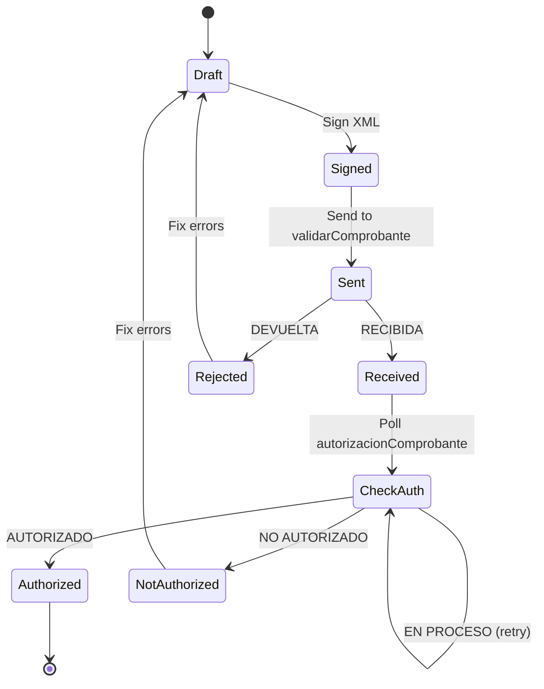
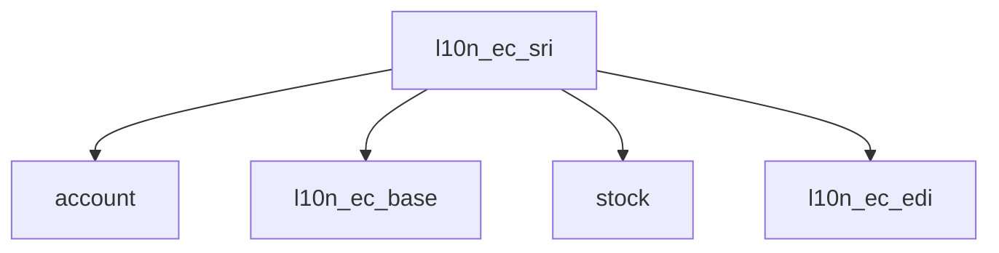

# SRS: SOMATECH ECUADOR SRI ELECTRONIC INVOICING MODULE
> **Complete Electronic Document & Tax Compliance System**
> **Version 1.0** | 2026-01-24 | ISO 9001:2015 Documentation

---

# DOCUMENT CONTROL

| Property | Value |
|----------|-------|
| **Document ID** | SRS-SRI-EC-001 |
| **Version** | 1.0 |
| **Status** | Draft |
| **Classification** | Internal |
| **Legal Basis** | LORTI, Resolución NAC-DGERCGC24-00000008 |
| **Regulatory Authority** | SRI (Servicio de Rentas Internas) |

---

# 1. EXECUTIVE SUMMARY

## 1.1 Purpose

This SRS defines requirements for the **Ecuador SRI Electronic Invoicing Module** (l10n_ec_sri) for Odoo 18. The module provides:

- Electronic document generation (XML)
- XAdES-BES digital signature
- SRI web service transmission
- Authorization management
- RIDE PDF generation

## 1.2 Document Types Covered

| Code | Document | Spanish Name |
|------|----------|--------------|
| **01** | Invoice | Factura |
| **03** | Liquidación de Compra | Liquidación de Compra |
| **04** | Credit Note | Nota de Crédito |
| **05** | Debit Note | Nota de Débito |
| **06** | Guía de Remisión | Guía de Remisión |
| **07** | Retención | Comprobante de Retención |

---

# 2. REGULATORY FRAMEWORK

## 2.1 Governing Regulations

| Regulation | Authority | Content |
|------------|-----------|---------|
| **LORTI** | Asamblea Nacional | Tax law |
| **Reglamento LORTI** | Presidente | Procedures |
| **Resolución NAC-DGERCGC25-00000017** | SRI | 2026 e-invoice rules |
| **Resolución NAC-DGERCGC25-00000014** | SRI | Base 2025 rules |
| **Ficha Técnica v2.1** | SRI | XML schemas |

## 2.2 Key 2026 Rules (CRITICAL)

> [!WARNING]
> **MAJOR 2026 CHANGES EFFECTIVE JANUARY 1, 2026**
> Per Resolución NAC-DGERCGC25-00000017, the following rules are NOW MANDATORY:

| Rule | Legal Basis | Implementation |
|------|-------------|----------------|
| **Real-time transmission** | Res. NAC-DGERCGC25-00000017 | Emission date = Operation date |
| **No deferred transmission** | Res. NAC-DGERCGC25-00000017 | NO more 4-day delay allowed |
| **CF invoices cannot be annulled** | Res. NAC-DGERCGC25-00000017 | Block CF annulment after transmission |
| Annulment deadline (non-CF) | Art. 193 Reglamento LORTI | Day 7 next month |
| IVA 15% | LORTI Art. 65 | Tax configuration |
| Auto-send on post | Res. NAC-DGERCGC25-00000017 | REQUIRED on `action_post()` |

> [!CAUTION]
> **ZERO HARDCODED VALUES**
> All regulatory values MUST be in `ir.config_parameter`.
> Code MUST raise ValidationError if configuration missing.

---

# 3. ACCESS KEY (CLAVE DE ACCESO)

## 3.1 Structure (49 digits)

| Position | Length | Content | Example |
|----------|--------|---------|---------|
| 1-8 | 8 | Emission date (DDMMAAAA) | 24012026 |
| 9-10 | 2 | Document type code | 01 |
| 11-23 | 13 | RUC issuer | 1791234567001 |
| 24 | 1 | Environment (1=test, 2=prod) | 2 |
| 25-27 | 3 | Establishment | 001 |
| 28-30 | 3 | Emission point | 001 |
| 31-39 | 9 | Sequential number | 000000123 |
| 40-47 | 8 | Numeric code (random) | 12345678 |
| 48 | 1 | Emission type (1=normal) | 1 |
| 49 | 1 | Check digit (mod 11) | 7 |

## 3.2 Generation Algorithm

```python
def generate_access_key(
    date: date,
    doc_type: str,
    ruc: str,
    environment: str,
    establishment: str,
    emission_point: str,
    sequential: str
) -> str:
    """
    Generate 49-digit SRI access key.
    All parameters from ir.config_parameter or document fields.
    """
    date_str = date.strftime('%d%m%Y')
    numeric_code = str(random.randint(10000000, 99999999))
    emission_type = '1'

    key_48 = (
        date_str +           # 8
        doc_type +           # 2
        ruc +                # 13
        environment +        # 1
        establishment +      # 3
        emission_point +     # 3
        sequential.zfill(9) + # 9
        numeric_code +       # 8
        emission_type        # 1
    )

    check_digit = mod11(key_48)
    return key_48 + str(check_digit)
```

---

# 4. XML GENERATION

## 4.1 Schema Structure

| Element | Content |
|---------|---------|
| `<factura>` | Root element |
| `<infoTributaria>` | Tax info (RUC, establishment) |
| `<infoFactura>` | Invoice info (date, customer) |
| `<detalles>` | Line items |
| `<infoAdicional>` | Additional info |

## 4.2 Required Fields per Document

### 4.2.1 Factura (01)

| XPath | Source | Validation |
|-------|--------|------------|
| `infoTributaria/ruc` | Company RUC | 13 digits |
| `infoTributaria/claveAcceso` | Generated | 49 digits |
| `infoFactura/fechaEmision` | Invoice date | DD/MM/YYYY |
| `infoFactura/identificacionComprador` | Partner VAT | Cédula/RUC/Pasaporte |
| `infoFactura/totalSinImpuestos` | Subtotal | 2 decimals |
| `infoFactura/totalDescuento` | Discount | 2 decimals |
| `infoFactura/importeTotal` | Total | 2 decimals |
| `detalles/detalle/codigoPrincipal` | Product code | Required |
| `detalles/detalle/cantidad` | Quantity | 6 decimals |
| `detalles/detalle/precioUnitario` | Unit price | 6 decimals |

### 4.2.2 Nota de Crédito (04)

| Additional Field | Content |
|------------------|---------|
| `codDocModificado` | 01 (modifies invoice) |
| `numDocModificado` | Original invoice number |
| `fechaEmisionDocSustento` | Original invoice date |
| `motivo` | Reason for credit |

### 4.2.3 Retención (07)

| Additional Field | Content |
|------------------|---------|
| `impuesto` | Tax type (1=Renta, 2=IVA, 6=ISD) |
| `codigoRetencion` | Retention code (Table 19/21) |
| `baseImponible` | Retention base |
| `porcentajeRetener` | Retention % |
| `valorRetenido` | Retention amount |

---

# 5. DIGITAL SIGNATURE (XAdES-BES)

## 5.1 Requirements

| Requirement | Specification |
|-------------|---------------|
| **Format** | XAdES-BES |
| **Algorithm** | SHA-256 with RSA |
| **Certificate** | .p12 file |
| **Issuer** | BCE, Security Data, ANF AC |
| **Key length** | 2048+ bits |

## 5.2 Signature Process


## 5.3 Certificate Model (l10n_ec.certificate)

| Field | Type | Description |
|-------|------|-------------|
| `name` | Char | Certificate name |
| `content` | Binary | .p12 file content |
| `password` | Char | P12 password (encrypted) |
| `issuer` | Char | Certificate authority |
| `valid_from` | Date | Valid from |
| `valid_to` | Date | Expiration date |
| `state` | Selection | draft/active/expired/revoked |

> [!WARNING]
> **SECURITY**: Certificate password MUST be encrypted at rest.
> Only users with `l10n_ec.group_sri_admin` can access.

---

# 6. SRI WEB SERVICES

## 6.1 Endpoints

| Environment | Reception WSDL | Authorization WSDL |
|-------------|----------------|-------------------|
| **Test** | `https://celcer.sri.gob.ec/comprobantes-electronicos-ws/RecepcionComprobantesOffline?wsdl` | `https://celcer.sri.gob.ec/comprobantes-electronicos-ws/AutorizacionComprobantesOffline?wsdl` |
| **Production** | `https://cel.sri.gob.ec/comprobantes-electronicos-ws/RecepcionComprobantesOffline?wsdl` | `https://cel.sri.gob.ec/comprobantes-electronicos-ws/AutorizacionComprobantesOffline?wsdl` |

## 6.2 Reception Service

| Method | Input | Output |
|--------|-------|--------|
| `validarComprobante` | Signed XML (base64) | Status + messages |

| Response Status | Meaning |
|-----------------|---------|
| `RECIBIDA` | Accepted for processing |
| `DEVUELTA` | Rejected with errors |

## 6.3 Authorization Service

| Method | Input | Output |
|--------|-------|--------|
| `autorizacionComprobante` | Access key | Authorization status |

| Response Status | Meaning |
|-----------------|---------|
| `AUTORIZADO` | Approved by SRI |
| `NO AUTORIZADO` | Rejected |
| `EN PROCESO` | Still processing |

## 6.4 Transmission Flow



---

# 7. RIDE GENERATION

## 7.1 RIDE (Representación Impresa del Documento Electrónico)

| Section | Content |
|---------|---------|
| Header | Company logo, name, RUC |
| Access key | 49-digit + barcode |
| Document info | Date, customer, totals |
| Lines | Products, quantities, prices |
| Totals | Subtotal, IVA, total |
| Footer | Additional info, authorization |

## 7.2 Requirements

| Requirement | Specification |
|-------------|---------------|
| Format | PDF |
| Barcode | Code 128 (access key) |
| Authorization number | From SRI response |
| Authorization date | From SRI response |

---

# 8. ERROR HANDLING

## 8.1 SRI Error Codes

| Code | Message | Resolution |
|------|---------|------------|
| 35 | Documento no autorizado | Check document errors |
| 43 | Clave de acceso registrada | Duplicate |
| 45 | RUC no existe | Invalid RUC |
| 67 | Secuencial ya registrado | Duplicate sequence |
| 70 | Clave de acceso inválida | Check mod 11 |

## 8.2 Retry Strategy

| Attempt | Wait | Action |
|---------|------|--------|
| 1 | 0s | Immediate |
| 2 | 5s | Retry |
| 3 | 30s | Retry |
| 4 | 5m | Retry |
| 5 | - | Manual intervention |

---

# 9. CONSUMIDOR FINAL RULES

## 9.1 Requirements (Res. NAC-DGERCGC25-00000017)

| Rule | Requirement | Config Key |
|------|-------------|------------|
| RUC | 9999999999999 | `l10n_ec.consumidor_final_ruc` |
| Max amount | $50 USD | `l10n_ec.consumidor_final_limit` |
| Name | CONSUMIDOR FINAL | Hardcoded label |
| Address | Not required | - |

> [!CAUTION]
> **CRITICAL 2026 RULE**: Invoices over $50 to Consumidor Final are INVALID.
> System MUST validate and block.

## 9.2 CF Annulment Prohibition (2026)

> [!WARNING]
> **EFFECTIVE JANUARY 1, 2026**: Per Resolución NAC-DGERCGC25-00000017,
> invoices emitted to **Consumidor Final CANNOT BE ANNULLED** once transmitted to SRI.
> This applies to BOTH electronic and physical invoices.
>
> If irregularities are detected, ONLY SRI can annul the document "de oficio".

| Scenario | Before Dec 31, 2025 | After Jan 1, 2026 |
|----------|--------------------|--------------------|
| CF invoice annulment | ✅ Allowed | ❌ PROHIBITED |
| Non-CF invoice annulment | ✅ Allowed (day 7) | ✅ Allowed (day 7) |

---

# 10. ANNULMENT

## 10.1 Annulment Rules (2026 Update)

| Document Type | Annulment Allowed | Deadline |
|---------------|-------------------|-----------|
| Factura to Consumidor Final | ❌ **PROHIBITED** | N/A |
| Factura to identified buyer | ✅ Yes | Day 7 next month |
| Nota de Crédito | ✅ Yes | Day 7 next month |
| Nota de Débito | ✅ Yes | Day 7 next month |
| Retención | ✅ Yes | Day 7 next month |
| Guía de Remisión | ✅ Yes | Day 7 next month |

## 10.2 Config Keys

| Key | Value | Description |
|-----|-------|-------------|
| `l10n_ec.annulment_day_limit` | 7 | Day of month deadline |
| `l10n_ec.cf_annulment_blocked` | true | Block CF annulment |

## 10.3 Process (Non-CF)

1. User clicks "Anular"
2. System checks if Consumidor Final → **BLOCK if CF**
3. System checks deadline (day 7 of next month)
4. If valid → Cancel in Odoo + notify SRI
5. If expired → Block with error message

## 10.4 Process (CF - 2026)

1. User clicks "Anular" on CF invoice
2. System **BLOCKS** action immediately
3. Show message: "Las facturas a Consumidor Final no pueden ser anuladas (Res. NAC-DGERCGC25-00000017)"

---

# 11. INTEGRATION

## 11.1 Module Dependencies



## 11.2 Hooks

| Model | Hook | Action |
|-------|------|--------|
| `account.move` | `action_post()` | Auto-send to SRI |
| `account.move` | `button_cancel()` | Check annulment deadline |
| `stock.picking` | `action_send_guia_sri()` | Send Guía de Remisión |

---

# 12. CONFIGURATION

## 12.1 System Parameters

| Key | Description | Default |
|-----|-------------|---------|
| `l10n_ec.sri_environment` | test/production | test |
| `l10n_ec.consumidor_final_ruc` | CF RUC | 9999999999999 |
| `l10n_ec.consumidor_final_limit` | CF max amount | 50.00 |
| `l10n_ec.annulment_day_limit` | Annulment deadline | 7 |
| `l10n_ec.auto_send_on_post` | Auto-send invoices | true |

## 12.2 Company Configuration

| Field | Type | Description |
|-------|------|-------------|
| `l10n_ec_sri_environment` | Selection | Test/Production |
| `l10n_ec_certificate_id` | Many2one | Active certificate |
| `l10n_ec_emission_type` | Selection | Normal/Contingency |

---

# 13. TESTING

## 13.1 Unit Tests

| Test ID | Description |
|---------|-------------|
| UT-SRI-001 | Access key generation (mod 11) |
| UT-SRI-002 | XML schema validation |
| UT-SRI-003 | Signature verification |
| UT-SRI-004 | CF limit validation |
| UT-SRI-005 | Annulment deadline check |

## 13.2 Integration Tests

| Test ID | Description |
|---------|-------------|
| IT-SRI-001 | End-to-end invoice transmission |
| IT-SRI-002 | Credit note with reference |
| IT-SRI-003 | Retry on SRI timeout |
| IT-SRI-004 | Certificate expiration handling |

---

# 14. SECURITY

## 14.1 Access Control

| Group | Permissions |
|-------|-------------|
| `l10n_ec.group_sri_user` | View, transmit |
| `l10n_ec.group_sri_manager` | + Cancel, configure |
| `l10n_ec.group_sri_admin` | + Certificates, settings |

## 14.2 Audit Trail

| Event | Logged Data |
|-------|-------------|
| Transmission | User, timestamp, access key, status |
| Authorization | Timestamp, auth number |
| Cancellation | User, timestamp, reason |
| Certificate change | User, timestamp, old/new |

---

# 15. GLOSSARY

| Term | Definition |
|------|------------|
| **SRI** | Servicio de Rentas Internas |
| **LORTI** | Ley Orgánica de Régimen Tributario Interno |
| **Access Key** | 49-digit unique document identifier |
| **XAdES-BES** | XML Advanced Electronic Signatures |
| **RIDE** | Representación Impresa del Documento Electrónico |
| **CF** | Consumidor Final |

---

# 16. REFERENCES

| Source | URL |
|--------|-----|
| SRI Portal | https://www.sri.gob.ec |
| Ficha Técnica | https://www.sri.gob.ec/facturacion-electronica |
| WSDL Docs | https://cel.sri.gob.ec |

---

**Document Control**

| Version | Date | Author | Changes |
|---------|------|--------|---------|
| 1.0 | 2026-01-24 | Somatech | Initial SRS |

---

**END OF SRS**
