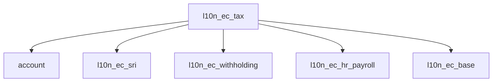
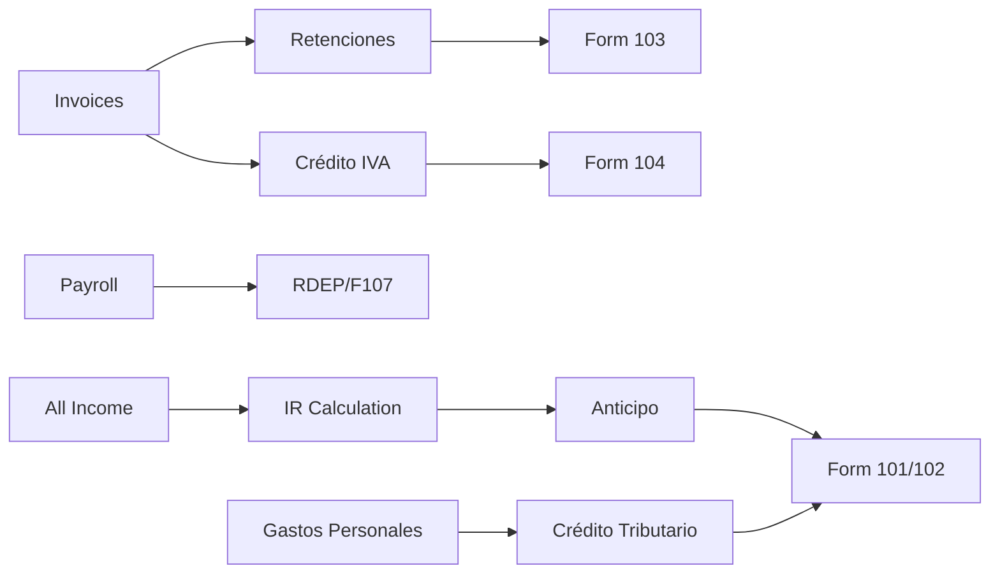

# SRS: SOMATECH ECUADOR TAX COMPLIANCE MODULE
> **Complete Tax Declaration, Anticipos & Crédito Tributario System**
> **Version 1.0** | 2026-01-24 | LORTI FULL COMPLIANCE

---

# DOCUMENT CONTROL

| Property | Value |
|----------|-------|
| **Document ID** | SRS-TAX-EC-001 |
| **Version** | 1.0 |
| **Status** | Draft |
| **Classification** | Internal |
| **Legal Basis** | LORTI, Reglamento LORTI, NAC-DGERCGC25-00000043 |
| **Regulatory Authority** | SRI |

---

# 1. SCOPE

This module covers ALL tax obligations under LORTI:

```
┌─────────────────────────────────────────────────────────────────────┐
│                    ECUADOR TAX OBLIGATIONS                          │
├─────────────────────────────────────────────────────────────────────┤
│                                                                     │
│  ✅ Impuesto a la Renta (Income Tax - IR)                          │
│  ✅ Anticipo del Impuesto a la Renta (IR Advance)                  │
│  ✅ Anticipo Utilidades No Distribuidas (NEW 2026)                 │
│  ✅ IVA (Value Added Tax)                                          │
│  ✅ Retenciones en la Fuente (Withholdings)                        │
│  ✅ Crédito Tributario (Tax Credits)                               │
│  ✅ Gastos Personales (Personal Expenses)                          │
│  ✅ ATS (Anexo Transaccional Simplificado)                         │
│  ✅ RDEP (Anexo Relación de Dependencia)                           │
│                                                                     │
│  FORMS COVERED:                                                     │
│  • Formulario 101 - Declaración IR Sociedades                      │
│  • Formulario 102 - Declaración IR Personas Naturales              │
│  • Formulario 103 - Retenciones en la Fuente                       │
│  • Formulario 104 - Declaración IVA                                │
│  • Formulario 107 - Certificado Retenciones Empleados              │
│                                                                     │
└─────────────────────────────────────────────────────────────────────┘
```

---

# 2. IMPUESTO A LA RENTA (LORTI Title I)

## 2.1 Legal Basis

| Article | Content |
|---------|---------|
| **Art. 1** | Object of tax (global income) |
| **Art. 2** | Taxable income definition |
| **Art. 3-6** | Exempt income |
| **Art. 7-10** | Taxpayers (sujetos pasivos) |
| **Art. 11-15** | Taxable base calculation |
| **Art. 36** | Tax rate for sociedades (25%) |
| **Art. 37** | Progressive rates for personas naturales |
| **Art. 41** | ANTICIPO del Impuesto a la Renta |

## 2.2 Tax Rates 2026

### 2.2.1 Sociedades (Art. 36 LORTI)

| Type | Rate | Config Key |
|------|------|------------|
| General rate | 25% | `l10n_ec.ir_sociedades_general` |
| Microempresas | 0-2% (RIMPE) | `l10n_ec.rimpe_*` |
| Reinversión benefit | -10% | `l10n_ec.ir_reinversion` |

### 2.2.2 Personas Naturales 2026 (Res. NAC-DGERCGC25-00000043)

| Fracción Básica | Exceso Hasta | Impuesto FB | % Excedente |
|-----------------|--------------|-------------|-------------|
| $0 | $12,208 | $0 | 0% |
| $12,208 | $15,549 | $0 | 5% |
| $15,549 | $20,188 | $167 | 10% |
| $20,188 | $26,700 | $631 | 12% |
| $26,700 | $35,136 | $1,412 | 15% |
| $35,136 | $46,575 | $2,678 | 20% |
| $46,575 | $62,005 | $4,965 | 25% |
| $62,005 | $82,679 | $8,823 | 30% |
| $82,679 | $109,956 | $15,025 | 35% |
| $109,956 | En adelante | $24,572 | 37% |

> [!CAUTION]
> These MUST be stored in `l10n_ec.income.tax.bracket` model, NOT hardcoded.
> Base exenta 2026 = $12,208 (increased from $12,081 in 2025).

---

# 3. ANTICIPO DEL IMPUESTO A LA RENTA (Art. 41 LORTI)

## 3.1 Legal Basis

| Regulation | Content |
|------------|---------|
| **Art. 41 LORTI** | Anticipo obligation |
| **Art. 76-77 Reglamento** | Calculation method |
| **Decreto 806 (2019)** | Modified calculation |
| **Decreto 191 (2025)** | Anticipo utilidades no distribuidas |

## 3.2 Types of Anticipo

### 3.2.1 Anticipo General (Art. 41 LORTI)

**Formula (Current - post Decreto 806):**
```
Anticipo = IR Causado año anterior - Retenciones año anterior
```

**Payment Schedule 2026:**

| Payment | Month | Deadline |
|---------|-------|----------|
| Cuota 1 | Julio | 10-28 (por 9no dígito RUC) |
| Cuota 2 | Septiembre | 10-28 (por 9no dígito RUC) |

### 3.2.2 Anticipo Voluntario

| Rule | Value |
|------|-------|
| Base | 50% IR causado año anterior - Retenciones |
| Option | Contribuyente puede pagar más voluntariamente |
| Benefit | Crédito tributario para IR definitivo |

### 3.2.3 Anticipo Utilidades No Distribuidas (NEW 2026)

> [!WARNING]
> **NEW RULE - Decreto 191 (October 2025)**
> Effective for fiscal year 2026

| Requirement | Detail |
|-------------|--------|
| **Applies to** | Sociedades with undistributed accumulated profits |
| **Trigger date** | July 31 of each year |
| **Payment month** | August (per 9no dígito RUC) |
| **Base** | Utilidades acumuladas no distribuidas |

**Rate Table (Art. 77 Reglamento reformado):**

| Base Imponible | Rate |
|----------------|------|
| Tramo 1 | 0% |
| Tramo 2 | 0.50% |
| Tramo 3 | 1.00% |
| Tramo 4 | 1.50% |
| Tramo 5 | 2.00% |
| Tramo 6 | 2.50% |

> [!CAUTION]
> Rates MUST be configurable via `ir.config_parameter`.
> Full calculation formula per Decreto 191 reglamento.

## 3.3 Anticipo Model (l10n_ec.tax.anticipo)

| Field | Type | Description |
|-------|------|-------------|
| `fiscal_year` | Integer | Fiscal year |
| `company_id` | Many2one | Company |
| `anticipo_type` | Selection | general/voluntario/utilidades |
| `ir_causado_anterior` | Monetary | IR caused previous year |
| `retenciones_anterior` | Monetary | Withholdings previous year |
| `anticipo_calculado` | Monetary | Calculated advance |
| `cuota_1` | Monetary | First payment |
| `cuota_2` | Monetary | Second payment |
| `cuota_1_date` | Date | First payment date |
| `cuota_2_date` | Date | Second payment date |
| `cuota_1_paid` | Boolean | First cuota paid |
| `cuota_2_paid` | Boolean | Second cuota paid |
| `state` | Selection | draft/confirmed/paid |

## 3.4 Crédito Tributario from Anticipo

Anticipo paid → Crédito tributario available for:
- Annual IR declaration (Form 101/102)
- Offset against IR causado
- Excess → Refund request or carry forward

---

# 4. CRÉDITO TRIBUTARIO (Art. 47 LORTI)

## 4.1 Types of Tax Credits

| Type | Source | Application |
|------|--------|-------------|
| **Retenciones IR** | Purchases, services | IR anual |
| **Anticipo pagado** | Anticipo cuotas | IR anual |
| **IVA Compras** | Purchase invoices | IVA mensual |
| **Retenciones IVA** | Received retentions | IVA mensual |
| **Gastos Personales** | Personal expenses (2026 change) | IR anual |
| **Crédito Exterior** | Foreign taxes paid | IR anual |

## 4.2 Crédito Tributario Model (l10n_ec.tax.credit)

| Field | Type | Description |
|-------|------|-------------|
| `fiscal_year` | Integer | Applicable year |
| `credit_type` | Selection | Type of credit |
| `source_document` | Reference | Origin document |
| `amount` | Monetary | Credit amount |
| `used_amount` | Monetary | Amount applied |
| `remaining` | Monetary | Unused balance |
| `expiry_date` | Date | Expiration (if any) |
| `state` | Selection | available/used/expired |

## 4.3 IVA Tax Credit Calculation

```python
def compute_iva_credit(period):
    """
    IVA crédito tributario = IVA pagado en compras (gravadas 15%)
    Not applicable for: Exentas, 0% purchases
    """
    iva_purchases = sum(
        invoice.l10n_ec_iva_amount
        for invoice in period.purchase_invoices
        if invoice.l10n_ec_iva_rate > 0
    )

    iva_retention_received = sum(
        retention.amount
        for retention in period.received_retentions
        if retention.tax_type == 'IVA'
    )

    return iva_purchases + iva_retention_received
```

---

# 5. GASTOS PERSONALES (Art. 10 num. 16 LORTI)

## 5.1 2026 Change - Now a Tax Credit!

> [!WARNING]
> **CRITICAL 2026 CHANGE**
> Gastos personales NO LONGER reduce taxable income directly.
> Instead, they generate a **CRÉDITO TRIBUTARIO** that reduces IR causado.

| Before 2026 | After 2026 |
|-------------|------------|
| Deducted from income | Generates tax CREDIT |
| Reduced taxable base | Reduces IR causado directly |

## 5.2 Categories and Limits

| Category | Spanish | Limit (% SBU) |
|----------|---------|---------------|
| Housing | Vivienda | Configurable |
| Education | Educación | Configurable |
| Health | Salud | Configurable (with emphasis) |
| Food | Alimentación | Configurable |
| Clothing | Vestimenta | Configurable |
| **Total** | - | Based on cargas familiares |

## 5.3 Cargas Familiares Limit (2026)

| # of Dependents | Max Total Expenses |
|-----------------|-------------------|
| 0 | Configurable |
| 1 | Configurable |
| 2 | Configurable |
| 3+ | Configurable |

> [!IMPORTANT]
> Dependents include: Hijos, cónyuge/pareja, padres, otros dependientes.
> All limits via `ir.config_parameter`.

## 5.4 Proyección Gastos Personales (Employees)

| Requirement | Detail |
|-------------|--------|
| Who | Employees in relación de dependencia |
| When initial | January of fiscal year |
| Updates | June, September optional |
| Form | Internal projection to employer |
| Use | Monthly IR withholding calculation |

## 5.5 Model (l10n_ec.personal.expenses)

| Field | Type | Description |
|-------|------|-------------|
| `employee_id` | Many2one | Employee |
| `fiscal_year` | Integer | Year |
| `housing` | Monetary | Vivienda |
| `education` | Monetary | Educación |
| `health` | Monetary | Salud |
| `food` | Monetary | Alimentación |
| `clothing` | Monetary | Vestimenta |
| `total` | Monetary | Sum (computed) |
| `max_allowed` | Monetary | Based on cargas |
| `tax_credit` | Monetary | Credit generated |
| `dependents_count` | Integer | Cargas familiares |
| `projection_date` | Date | Statement date |
| `state` | Selection | draft/confirmed/applied |

---

# 6. FORMULARIOS SRI

## 6.1 Formulario 101 - Declaración IR Sociedades

| Section | Content |
|---------|---------|
| **Identification** | RUC, razón social, fiscal year |
| **Ingresos** | Revenue by type |
| **Costos y Gastos** | Deductible expenses |
| **Conciliación Tributaria** | Adjustments |
| **Base Imponible** | Taxable base |
| **Impuesto Causado** | Tax calculated |
| **Créditos Tributarios** | Retenciones, anticipo |
| **Saldo a Pagar/Favor** | Balance |

**Deadline 2026:** April 10-28 (per 9no dígito RUC)

## 6.2 Formulario 102 - Declaración IR Personas Naturales

| Section | Content |
|---------|---------|
| **Identification** | Cédula/RUC, name |
| **Ingresos** | Salary, freelance, other |
| **Gastos Deducibles** | Business expenses |
| **Gastos Personales** | → Generates tax credit |
| **Base Imponible** | Taxable base |
| **Impuesto Causado** | Per progressive table |
| **Crédito Gtos Personales** | NEW 2026 |
| **Retenciones** | Withholdings received |
| **Saldo** | Balance |

**Deadline 2026:** March 10-28 (per 9no dígito RUC)

## 6.3 Formulario 103 - Retenciones en la Fuente

> [!WARNING]
> **2026 CHANGES (effective Sep 2025):**
> - Payment SAME DAY as declaration
> - Only 7 days to correct errors
> - Auto-load of electronic vouchers by SRI
> - Pre-validation of codes and percentages

| Casillero | Content |
|-----------|---------|
| 301-349 | IR Retentions (Table 19) |
| 401-449 | IVA Retentions (Table 21) |
| 500+ | Totals |

**Deadline:** Monthly, 10-28 of following month

## 6.4 Formulario 104 - Declaración IVA

| Section | Content |
|---------|---------|
| **Ventas** | Sales by IVA rate |
| **Compras** | Purchases by IVA rate |
| **IVA Cobrado** | IVA on sales |
| **IVA Pagado** | IVA on purchases (crédito) |
| **Retenciones Realizadas** | Withholdings done |
| **Retenciones Recibidas** | Withholdings received |
| **Saldo** | Balance to pay/credit |

**Deadline:** Monthly, 10-28 of following month

## 6.5 Formulario 107 - Certificado Empleados

PDF certificate issued by employer to employee containing:
- Total income (sueldos, horas extra, comisiones)
- IESS personal contributions
- IR withheld
- Used for employee Form 102

**Deadline 2026:** January 31

---

# 7. ATS (Anexo Transaccional Simplificado)

## 7.1 Content

| Section | Data |
|---------|------|
| **Compras** | All purchases with RUC/CF |
| **Ventas** | All sales by customer |
| **Exportaciones** | Export invoices |
| **Comprobantes Anulados** | Voided documents |
| **Retenciones** | All retentions issued |

## 7.2 Casilleros Key

| Range | Content |
|-------|---------|
| 401-405 | Purchases by type |
| 500-505 | Sales by type |
| 600+ | Retentions |

**Deadline:** Monthly, 10-28 of following month

---

# 8. CALENDAR 2026

## 8.1 Monthly Obligations

| Day | Obligation | Form |
|-----|------------|------|
| 10-28 | IVA Declaration | 104 |
| 10-28 | Retenciones | 103 |
| 10-28 | ATS | XML |

## 8.2 Annual Obligations

| Month | Obligation | Form |
|-------|------------|------|
| January | F107 to employees | 107 |
| January | RDEP | XML |
| March | IR Personas Naturales | 102 |
| April | IR Sociedades | 101 |
| July | Anticipo Cuota 1 | - |
| August | Anticipo Utilidades ND | - |
| September | Anticipo Cuota 2 | - |
| December 24 | Décimo Tercero | MDT |

---

# 9. CONFIGURATION

## 9.1 System Parameters

| Key | Description |
|-----|-------------|
| `l10n_ec.ir_sociedades_general` | Corporate rate (25%) |
| `l10n_ec.base_exenta_2026` | Base exenta ($12,208) |
| `l10n_ec.anticipo_utilidades_tramo_*` | Rate brackets |
| `l10n_ec.gastos_personales_max_*` | Personal expense limits |
| `l10n_ec.cargas_familiares_max_*` | Dependent limits |

## 9.2 Accounting Accounts

| Concept | Account |
|---------|---------|
| IR por Pagar | 2.1.x.x |
| Anticipo IR | 1.2.x.x (Asset) |
| Crédito Tributario IR | 1.2.x.x |
| Crédito Tributario IVA | 1.2.x.x |
| IVA por Pagar | 2.1.x.x |
| Retenciones por Pagar | 2.1.x.x |

---

# 10. INTEGRATION

## 10.1 Dependencies



## 10.2 Data Flow



---

# 11. TESTING

## 11.1 Unit Tests

| Test ID | Description |
|---------|-------------|
| UT-TAX-001 | IR sociedades calculation (25%) |
| UT-TAX-002 | IR personas naturales (progressive) |
| UT-TAX-003 | Anticipo general calculation |
| UT-TAX-004 | Anticipo utilidades ND (2026) |
| UT-TAX-005 | IVA crédito tributario |
| UT-TAX-006 | Gastos personales → tax credit |
| UT-TAX-007 | Form 103 totals |
| UT-TAX-008 | Form 104 balance |

## 11.2 Regulatory Tests

| Test ID | Description |
|---------|-------------|
| RT-TAX-001 | All rates from config (zero hardcoding) |
| RT-TAX-002 | Tax brackets match SRI 2026 |
| RT-TAX-003 | Anticipo dates per calendar |
| RT-TAX-004 | F103 same-day payment validation |

---

# 12. GLOSSARY

| Term | Definition |
|------|------------|
| **IR** | Impuesto a la Renta |
| **Anticipo** | Income tax advance payment |
| **Crédito Tributario** | Tax credit |
| **IVA** | Impuesto al Valor Agregado |
| **LORTI** | Ley Orgánica de Régimen Tributario Interno |
| **ATS** | Anexo Transaccional Simplificado |
| **RDEP** | Retenciones bajo Relación de Dependencia |
| **Cargas Familiares** | Dependent family members |
| **Base Exenta** | Tax-free threshold |
| **IR Causado** | Tax liability before credits |

---

# 13. REFERENCES

| Source | URL |
|--------|-----|
| LORTI | https://www.sri.gob.ec/normativa |
| Reglamento LORTI | https://www.sri.gob.ec/normativa |
| Decreto 191 | Registro Oficial 2025 |
| NAC-DGERCGC25-00000043 | Tax brackets 2026 |
| Calendario Tributario 2026 | https://www.sri.gob.ec |

---

**Document Control**

| Version | Date | Author | Changes |
|---------|------|--------|---------|
| 1.0 | 2026-01-24 | Somatech | Complete tax SRS |

---

**END OF SRS**
