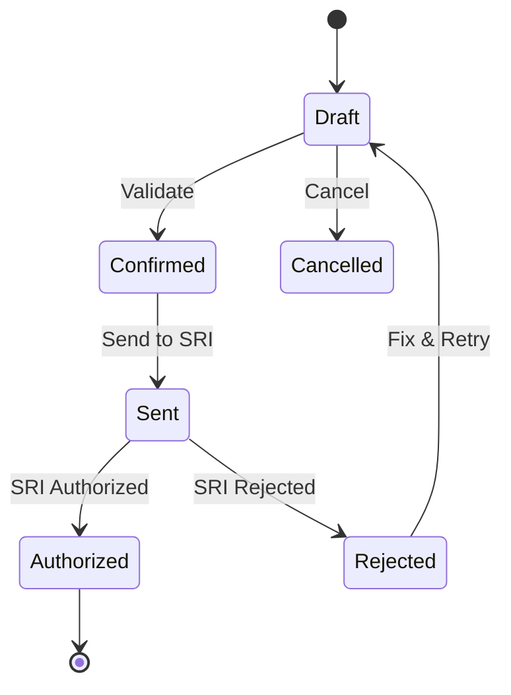

# SRS: SOMATECH ECUADOR WITHHOLDING MODULE
> **Complete Tax Retention & Compliance System**
> **Version 1.0** | 2026-01-24 | ISO 9001:2015 Documentation

---

# DOCUMENT CONTROL

| Property | Value |
|----------|-------|
| **Document ID** | SRS-RET-EC-001 |
| **Version** | 1.0 |
| **Status** | Draft |
| **Classification** | Internal |
| **Legal Basis** | LORTI Art. 43-50, Resolución NAC-DGERCGC24-00000008 |
| **Regulatory Authority** | SRI |

---

# 1. EXECUTIVE SUMMARY

## 1.1 Purpose

This SRS defines requirements for the **Ecuador Withholding Module** (l10n_ec_withholding) for Odoo 18. The module manages:

- Comprobantes de Retención (Retention Vouchers)
- Income Tax Withholdings (Retención IR)
- IVA Withholdings (Retención IVA)
- ISD Withholdings (Impuesto Salida Divisas)
- Dividend Withholdings
- Electronic transmission to SRI

## 1.2 Scope

| In Scope | Out of Scope |
|----------|--------------|
| ✅ IR withholdings on purchases | ❌ Payroll IR withholding (separate module) |
| ✅ IVA withholdings | ❌ Autonomous withholding |
| ✅ ISD withholdings | ❌ International treaties |
| ✅ Dividend withholdings | |
| ✅ SRI transmission | |

---

# 2. REGULATORY FRAMEWORK

## 2.1 Governing Laws

| Regulation | Articles | Content |
|------------|----------|---------|
| **LORTI** | Art. 43-50 | Withholding obligations |
| **Reglamento LORTI** | Art. 89-126 | Procedures |
| **Resolución NAC-DGERCGC15-00000284** | - | Retention percentages |
| **Resolución NAC-DGERCGC24-00000008** | - | Electronic retention |

## 2.2 Retention Agents (Art. 44 LORTI)

| Agent Type | Obligation |
|------------|------------|
| Public entities | All purchases |
| Business taxpayers | Purchases from individuals |
| Export companies | Service purchases |
| Credit card issuers | Card transactions |

## 2.3 Emission Deadline (Art. 193 Reglamento LORTI)

| Rule | Timeline |
|------|----------|
| **Emission** | At payment or credit time |
| **Maximum delay** | 5 business days from payment |
| **Annulment** | Day 7 of next month |

> [!WARNING]
> **2026 UPDATE**: Per SRI 2026 rules, the 5-day rule for retention
> emission is interpreted from DATE OF PAYMENT, not invoice date.

---

# 3. RETENTION TYPES

## 3.1 Income Tax Retention (Retención en la Fuente IR)

### 3.1.1 Table 19 - Retention Codes

| Code | Concept | Rate |
|------|---------|------|
| **303** | Honorarios profesionales | 10% |
| **304** | Servicios predomina intelecto | 8% |
| **307** | Servicios entre sociedades | 2% |
| **308** | Servicios publicidad/comunicación | 1.75% |
| **309** | Transporte privado | 1% |
| **310** | Transporte público | 1% |
| **312** | Transferencia bienes muebles | 1.75% |
| **319** | Arrendamiento bienes inmuebles | 8% |
| **320** | Arrendamiento bienes inmuebles | 2.75% |
| **322** | Seguros/reaseguros | 1.75% |
| **323** | Rendimientos financieros | 2% |
| **325** | Loterías/rifas/apuestas | 15% |
| **327** | Venta combustibles | 0.2% |
| **332** | Pagos exterior (general) | 25% |
| **340** | Otras retenciones | 2.75% |
| **343** | Servicios digitales exterior | 25% |

### 3.1.2 Dividend Withholding (2026)

| Recipient Type | Rate | Code |
|----------------|------|------|
| Resident individual | 0% | 332A |
| Non-resident individual | 10% | 332B |
| Tax haven entity | 12% | 332C |
| EU/Treaty country | 14% | 332D |
| Ecuadorian company | 0% | - |

> [!IMPORTANT]
> Dividend rates added per LORTI Art. 39.
> Rates MUST be configurable via `ir.config_parameter`.

## 3.2 IVA Retention (Retención IVA)

### 3.2.1 Table 21 - IVA Retention Codes

| Code | Concept | Rate |
|------|---------|------|
| **1** | 10% IVA (Bienes) | 10% |
| **2** | 20% IVA (Servicios) | 20% |
| **3** | 30% IVA (Bienes) | 30% |
| **4** | 50% IVA | 50% |
| **5** | 70% IVA | 70% |
| **6** | 100% IVA | 100% |
| **7** | 100% IVA Convenio/Ley | 100% |
| **8** | Retención IVA CF | - |
| **9** | No procede | 0% |

### 3.2.2 IVA Retention Matrix

| Retention Agent | Supplier Type | Goods | Services |
|-----------------|---------------|-------|----------|
| Contribuyente Especial | Sociedad | 30% | 70% |
| Contribuyente Especial | Persona Natural | 30% | 100% |
| Sociedad | Persona Natural | 30% | 100% |
| Sociedad | Sociedad | 0% | 0% |
| Exportador | Any | 100% | 100% |

## 3.3 ISD Retention (Art. 156 LORTI)

| Transaction | Rate | Base |
|-------------|------|------|
| Payments abroad | 5% | Payment amount |
| Import financing | 5% | Interest |
| Dividends abroad | 5% | Dividend amount |

---

# 4. FUNCTIONAL REQUIREMENTS

## 4.1 Retention Model (account.retention)

### 4.1.1 Header Fields

| Field | Type | Description | Required |
|-------|------|-------------|----------|
| `name` | Char | Retention number | Auto |
| `partner_id` | Many2one | Supplier | Yes |
| `date` | Date | Retention date | Yes |
| `invoice_id` | Many2one | Related purchase invoice | Yes |
| `state` | Selection | Workflow state | Auto |
| `sri_access_key` | Char | 49-digit access key | Auto |
| `sri_status` | Selection | SRI transmission status | Auto |
| `sri_authorization` | Char | SRI authorization number | Auto |

### 4.1.2 Workflow States



## 4.2 Retention Line Model (account.retention.line)

| Field | Type | Description |
|-------|------|-------------|
| `retention_id` | Many2one | Parent retention |
| `tax_type` | Selection | 1=IR, 2=IVA, 6=ISD |
| `tax_code` | Char | Table 19 or 21 code |
| `base` | Monetary | Retention base |
| `percentage` | Float | Retention % |
| `amount` | Monetary | Retention amount |
| `invoice_id` | Many2one | Supporting invoice |

## 4.3 Automatic Retention Calculation

### 4.3.1 On Purchase Invoice Validation

```python
def _compute_retentions(invoice):
    """
    Automatically calculate retention lines based on:
    - Supplier type (sociedad/persona natural)
    - Company type (contribuyente especial/sociedad)
    - Product/service category
    - Tax configuration
    """
    ICP = env['ir.config_parameter'].sudo()

    for line in invoice.invoice_line_ids:
        # IR Retention
        ir_code = line.product_id.l10n_ec_ir_retention_code
        if ir_code:
            ir_rate = get_ir_rate_from_config(ir_code)
            create_retention_line(
                tax_type='1',
                tax_code=ir_code,
                base=line.price_subtotal,
                percentage=ir_rate
            )

        # IVA Retention
        iva_code = determine_iva_retention(
            agent_type=invoice.company_id.l10n_ec_taxpayer_type,
            supplier_type=invoice.partner_id.l10n_ec_taxpayer_type,
            is_service=line.product_id.type == 'service'
        )
        if iva_code:
            iva_rate = get_iva_rate_from_config(iva_code)
            create_retention_line(
                tax_type='2',
                tax_code=iva_code,
                base=line.price_total - line.price_subtotal,  # IVA amount
                percentage=iva_rate
            )
```

## 4.4 Product Configuration

| Field | Type | Description |
|-------|------|-------------|
| `l10n_ec_ir_retention_code` | Char | Default IR code (Table 19) |
| `l10n_ec_ir_retention_rate` | Float | Override rate |
| `l10n_ec_iva_retention_code` | Char | Default IVA code (Table 21) |
| `l10n_ec_withholding_exempt` | Boolean | No withholding |

## 4.5 Partner Configuration

| Field | Type | Description |
|-------|------|-------------|
| `l10n_ec_taxpayer_type` | Selection | contribuyente_especial/sociedad/persona_natural/rise |
| `l10n_ec_withholding_agent` | Boolean | Is retention agent |
| `l10n_ec_exempt_ir` | Boolean | Exempt from IR retention |
| `l10n_ec_exempt_iva` | Boolean | Exempt from IVA retention |

---

# 5. XML GENERATION

## 5.1 Retention XML Schema

```xml
<comprobanteRetencion>
    <infoTributaria>
        <ambiente>2</ambiente>
        <tipoEmision>1</tipoEmision>
        <razonSocial>EMPRESA S.A.</razonSocial>
        <ruc>1791234567001</ruc>
        <claveAcceso>49 digits</claveAcceso>
        <codDoc>07</codDoc>
        <estab>001</estab>
        <ptoEmi>001</ptoEmi>
        <secuencial>000000001</secuencial>
        <dirMatriz>Quito, Ecuador</dirMatriz>
    </infoTributaria>
    <infoCompRetencion>
        <fechaEmision>24/01/2026</fechaEmision>
        <dirEstablecimiento>Quito, Ecuador</dirEstablecimiento>
        <contribuyenteEspecial>1234</contribuyenteEspecial>
        <obligadoContabilidad>SI</obligadoContabilidad>
        <tipoIdentificacionSujetoRetenido>04</tipoIdentificacionSujetoRetenido>
        <razonSocialSujetoRetenido>PROVEEDOR</razonSocialSujetoRetenido>
        <identificacionSujetoRetenido>1791234567001</identificacionSujetoRetenido>
        <periodoFiscal>01/2026</periodoFiscal>
    </infoCompRetencion>
    <impuestos>
        <impuesto>
            <codigo>1</codigo>
            <codigoRetencion>303</codigoRetencion>
            <baseImponible>1000.00</baseImponible>
            <porcentajeRetener>10.00</porcentajeRetener>
            <valorRetenido>100.00</valorRetenido>
            <codDocSustento>01</codDocSustento>
            <numDocSustento>001-001-000000123</numDocSustento>
            <fechaEmisionDocSustento>20/01/2026</fechaEmisionDocSustento>
        </impuesto>
    </impuestos>
</comprobanteRetencion>
```

---

# 6. ACCOUNTING INTEGRATION

## 6.1 Journal Entries

### 6.1.1 IR Retention

| Account | Debit | Credit |
|---------|-------|--------|
| Accounts Payable | X | - |
| Retenciones IR por Pagar | - | X |

### 6.1.2 IVA Retention

| Account | Debit | Credit |
|---------|-------|--------|
| Accounts Payable | X | - |
| Retenciones IVA por Pagar | - | X |

## 6.2 Tax Payment

Retained amounts → Pay to SRI monthly by Form 104

---

# 7. REPORTS

## 7.1 Required Reports

| Report | Frequency | Deadline |
|--------|-----------|----------|
| **RIDE Retención** | Per document | Immediate |
| **Anexo ATS** | Monthly | 28th next month |
| **Reporte Retenciones** | Monthly | Internal |

## 7.2 ATS Integration

| Casillero | Content |
|-----------|---------|
| 500-505 | Purchases with retention |
| 506 | Retention totals by code |
| 507 | IVA retention details |

---

# 8. CONFIGURATION

## 8.1 System Parameters

| Key | Description |
|-----|-------------|
| `l10n_ec.ret_ir_303` | Professional services rate (10%) |
| `l10n_ec.ret_ir_304` | Intellectual services rate (8%) |
| `l10n_ec.ret_ir_307` | Inter-company services rate (2%) |
| `l10n_ec.ret_ir_312` | Goods transfer rate (1.75%) |
| `l10n_ec.ret_iva_30` | IVA goods rate (30%) |
| `l10n_ec.ret_iva_70` | IVA services rate (70%) |
| `l10n_ec.ret_iva_100` | IVA full rate (100%) |
| `l10n_ec.ret_div_resident` | Dividend resident (0%) |
| `l10n_ec.ret_div_nonresident` | Dividend non-resident (10%) |
| `l10n_ec.ret_div_taxhaven` | Dividend tax haven (12%) |
| `l10n_ec.ret_div_treaty` | Dividend treaty (14%) |

> [!CAUTION]
> **ZERO HARDCODED VALUES**
> ALL rates MUST be in `ir.config_parameter`.
> Code MUST raise error if configuration missing.

---

# 9. TESTING

## 9.1 Unit Tests

| Test ID | Description |
|---------|-------------|
| UT-RET-001 | IR retention calculation (professional services) |
| UT-RET-002 | IVA retention matrix |
| UT-RET-003 | Dividend retention by recipient type |
| UT-RET-004 | XML generation validation |
| UT-RET-005 | Annulment deadline check |

## 9.2 Integration Tests

| Test ID | Description |
|---------|-------------|
| IT-RET-001 | End-to-end retention → SRI |
| IT-RET-002 | Retention with multiple invoices |
| IT-RET-003 | ATS generation with retentions |

---

# 10. SECURITY

## 10.1 Access Control

| Group | Permissions |
|-------|-------------|
| `l10n_ec.group_retention_user` | Create, view |
| `l10n_ec.group_retention_manager` | + Validate, send |
| `l10n_ec.group_retention_admin` | + Cancel, configure |

---

# 11. GLOSSARY

| Term | Definition |
|------|------------|
| **Retención en la Fuente** | Tax withheld at source |
| **Comprobante de Retención** | Retention voucher |
| **Table 19** | IR retention codes |
| **Table 21** | IVA retention codes |
| **ISD** | Impuesto a la Salida de Divisas |
| **ATS** | Anexo Transaccional Simplificado |

---

# 12. REFERENCES

| Source | URL |
|--------|-----|
| SRI | https://www.sri.gob.ec |
| Table 19 | https://www.sri.gob.ec/tablas-de-retencion |
| Table 21 | https://www.sri.gob.ec/tablas-de-retencion |

---

**Document Control**

| Version | Date | Author | Changes |
|---------|------|--------|---------|
| 1.0 | 2026-01-24 | Somatech | Initial SRS |

---

**END OF SRS**
