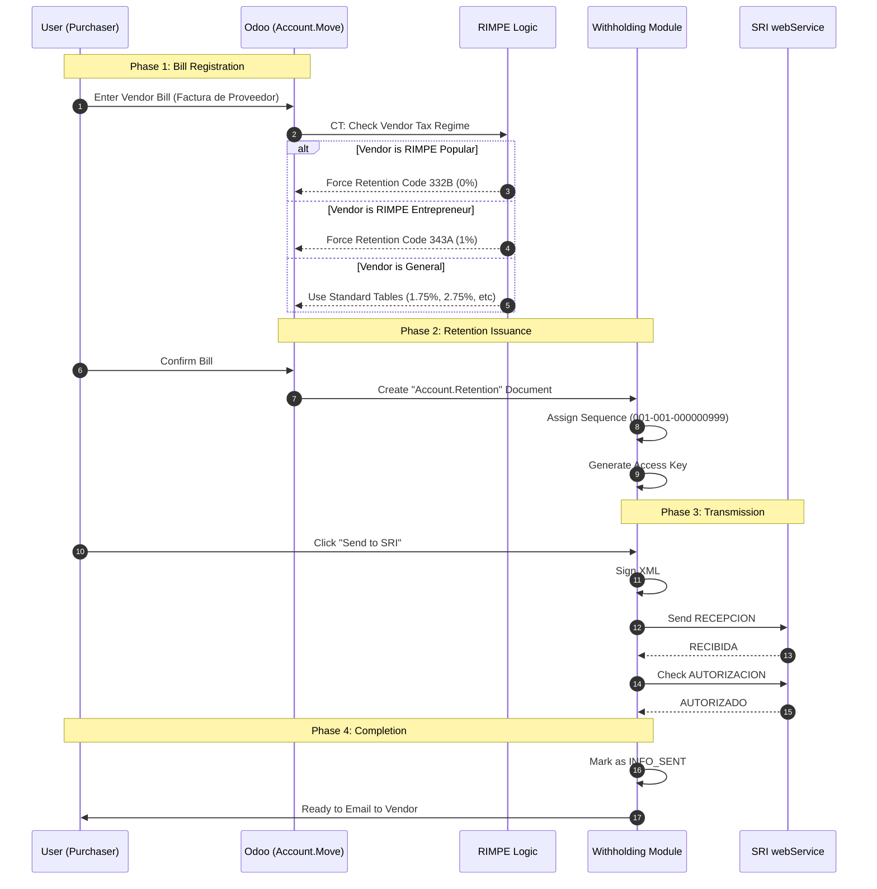

# SRI Purchase Retention Process Flow (Golden Path)
> **Persona**: Process Architect / Tax Expert
> **Scope**: Purchase Withholding (Retención en Compras)

```mermaid
sequenceDiagram
    autonumber
    participant U as User (Purchaser)
    participant O as Odoo (Account.Move)
    participant R as RIMPE Logic
    participant W as Withholding Module
    participant API as SRI webService

    Note over U, O: Phase 1: Bill Registration
    U->>O: Enter Vendor Bill (Factura de Proveedor)
    O->>R: CT: Check Vendor Tax Regime
    alt Vendor is RIMPE Popular
        R-->>O: Force Retention Code 332B (0%)
    else Vendor is RIMPE Entrepreneur
        R-->>O: Force Retention Code 343A (1%)
    else Vendor is General
        R-->>O: Use Standard Tables (1.75%, 2.75%, etc)
    end

    Note over O, W: Phase 2: Retention Issuance
    U->>O: Confirm Bill
    O->>W: Create "Account.Retention" Document
    W->>W: Assign Sequence (001-001-000000999)
    W->>W: Generate Access Key

    Note over W, API: Phase 3: Transmission
    U->>W: Click "Send to SRI"
    W->>W: Sign XML
    W->>API: Send RECEPCION
    API-->>W: RECIBIDA
    W->>API: Check AUTORIZACION
    API-->>W: AUTORIZADO

    Note over W, U: Phase 4: Completion
    W->>W: Mark as INFO_SENT
    W->>U: Ready to Email to Vendor
```
