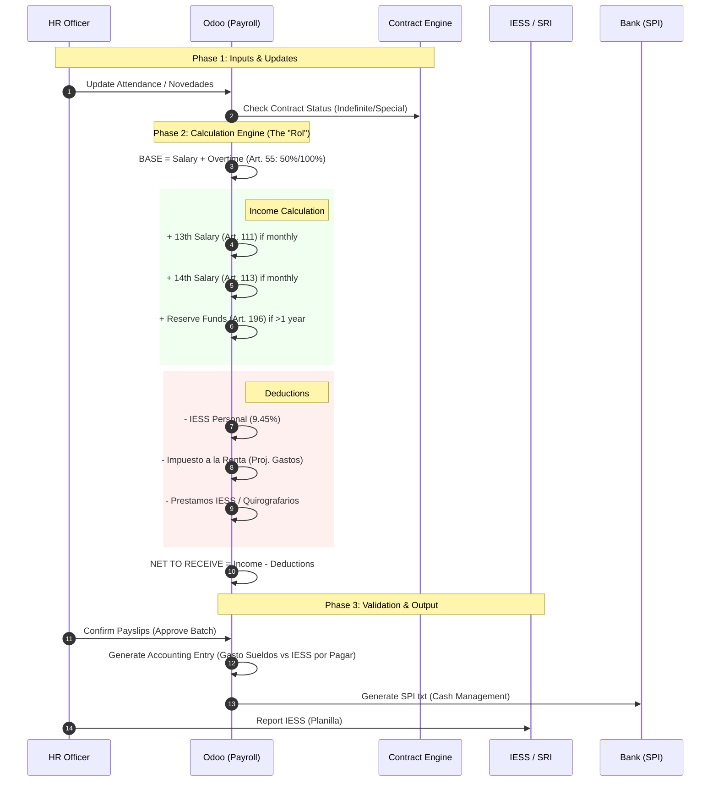

# Ecuador Payroll Process Flow (Golden Path)
> **Persona**: HR Manager / Labor Lawyer
> **Scope**: Monthly Payroll (Rol de Pagos) & Social Benefits
> **Legal Basis**: Código de Trabajo (Art. 42, 55, 111, 113, 196)

