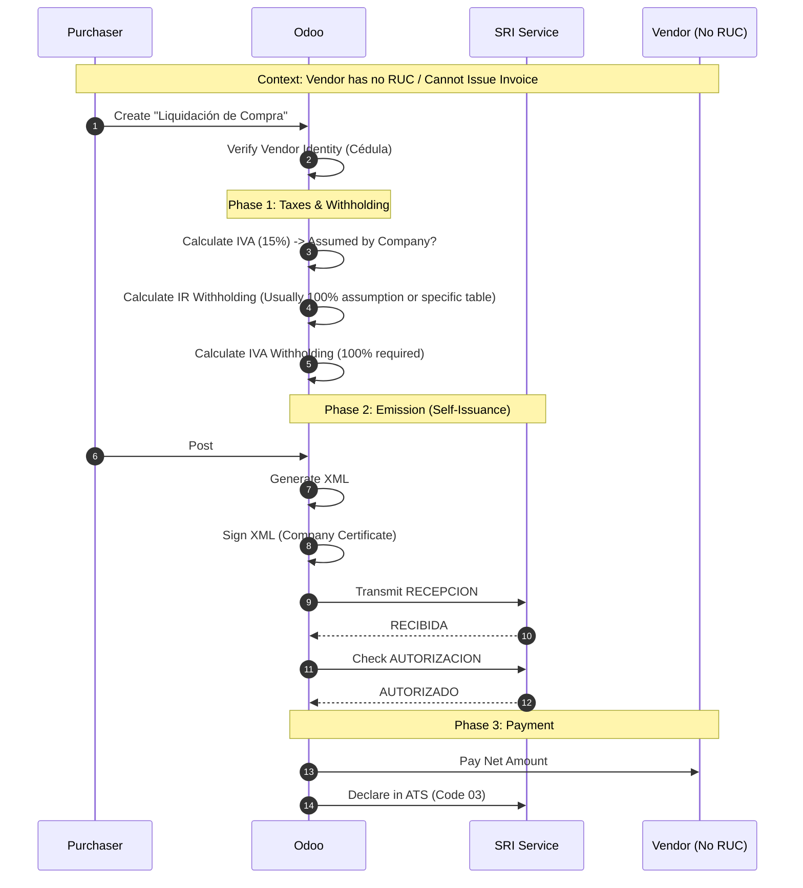

# SRI Liquidation of Purchases Flow (Golden Path)
> **Persona**: Purchasing Manager / Accountant
> **Scope**: Liquidación de Compras de Bienes y Prestación de Servicios
> **Legal Basis**: Reglamento Comprobantes de Venta (Art. 13)

