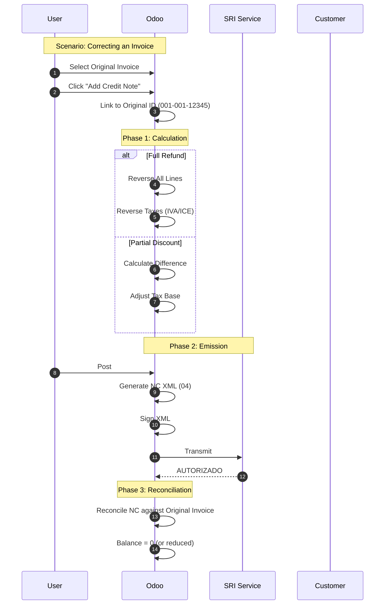

# SRI Credit/Debit Note Flow (Golden Path)
> **Persona**: Accountant / Sales Manager
> **Scope**: Notas de Crédito (Returns/Discounts) & Notas de Débito
> **Legal Basis**: Reglamento Comprobantes de Venta

