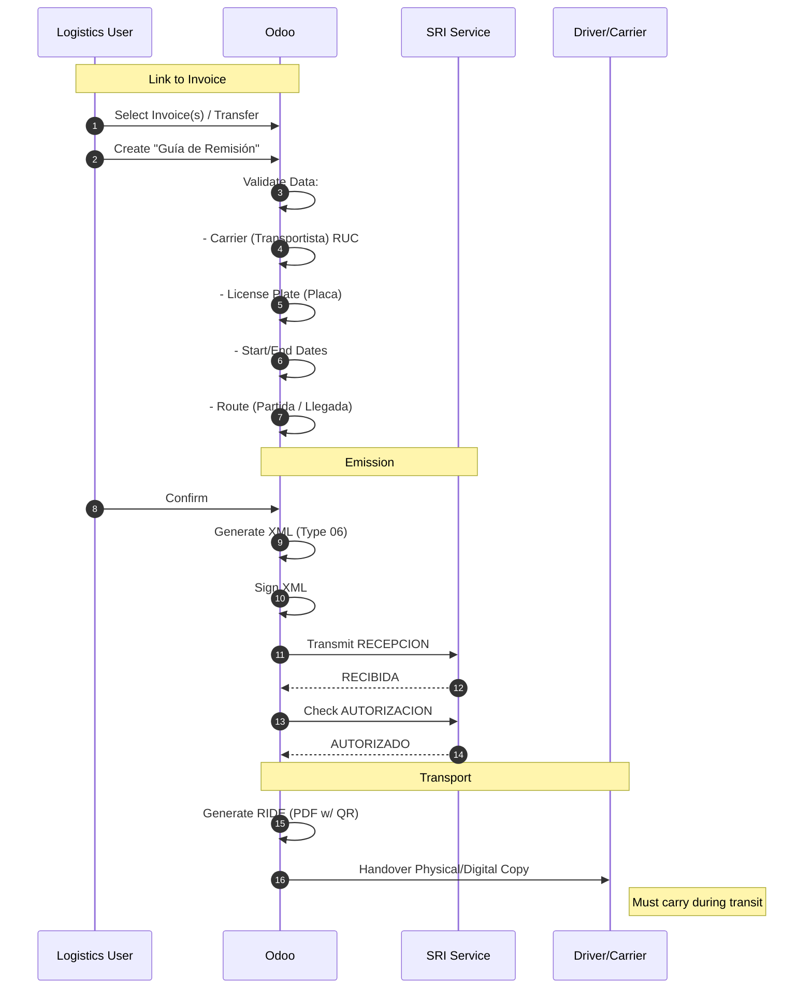

# SRI Delivery Guide Flow (Guía de Remisión)
> **Persona**: Logistics Manager
> **Scope**: Transport of Goods (Guía de Remisión)
> **Legal Basis**: Reglamento Comprobantes de Venta (Art. 19), NAC-DGERCGC21-00000032

