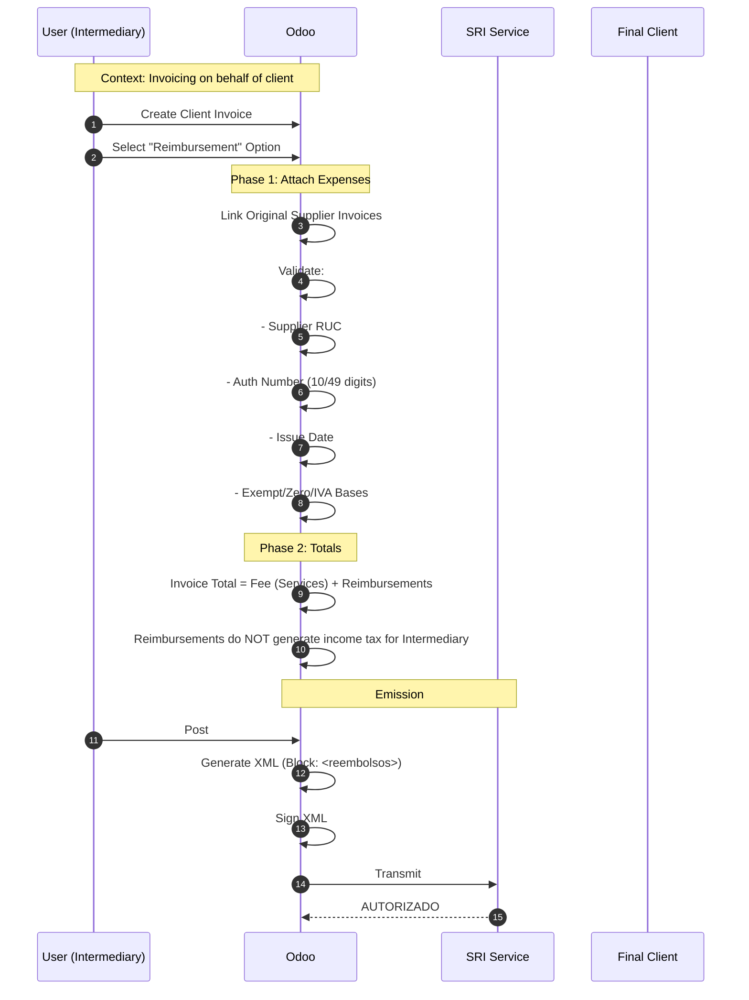

# SRI Expense Reimbursement Flow (Intermediaries)
> **Persona**: Accountant
> **Scope**: Reembolso de Gastos (Code 41)
> **Legal Basis**: Ficha Técnica SRI (Comprobantes Electrónicos)

```mermaid
sequenceDiagram
    autonumber
    participant U as User (Intermediary)
    participant O as Odoo
    participant S as SRI Service
    participant C as Final Client

    Note over U, O: Context: Invoicing on behalf of client
    U->>O: Create Client Invoice
    U->>O: Select "Reimbursement" Option

    Note over O, O: Phase 1: Attach Expenses
    O->>O: Link Original Supplier Invoices
    O->>O: Validate:
    O->>O: - Supplier RUC
    O->>O: - Auth Number (10/49 digits)
    O->>O: - Issue Date
    O->>O: - Exempt/Zero/IVA Bases

    Note over O, O: Phase 2: Totals
    O->>O: Invoice Total = Fee (Services) + Reimbursements
    O->>O: Reimbursements do NOT generate income tax for Intermediary

    Note over O, S: Emission
    U->>O: Post
    O->>O: Generate XML (Block: <reembolsos>)
    O->>O: Sign XML
    O->>S: Transmit
    S-->>O: AUTORIZADO
```
