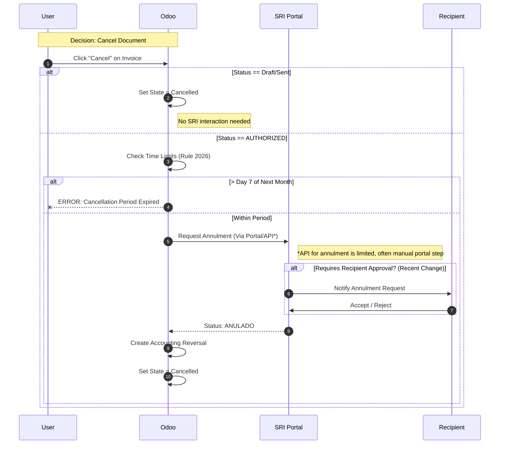

# SRI Document Annulment Flow (Lifecycle)
> **Persona**: Accountant
> **Scope**: Anulación de Comprobantes Autorizados
> **Legal Basis**: NAC-DGERCGC25-00000017 (2026 Rules)

```mermaid
sequenceDiagram
    autonumber
    participant U as User
    participant O as Odoo
    participant S as SRI Portal
    participant R as Recipient

    Note over U, O: Decision: Cancel Document
    U->>O: Click "Cancel" on Invoice

    alt Status == Draft/Sent
        O->>O: Set State = Cancelled
        Note right of O: No SRI interaction needed
    else Status == AUTHORIZED
        O->>O: Check Time Limits (Rule 2026)
        alt > Day 7 of Next Month
            O--xU: ERROR: Cancellation Period Expired
        else Within Period
            O->>S: Request Annulment (Via Portal/API*)
            Note right of S: *API for annulment is limited, often manual portal step

            alt Requires Recipient Approval? (Recent Change)
                S->>R: Notify Annulment Request
                R->>S: Accept / Reject
            end

            S-->>O: Status: ANULADO
            O->>O: Create Accounting Reversal
            O->>O: Set State = Cancelled
        end
    end
```
